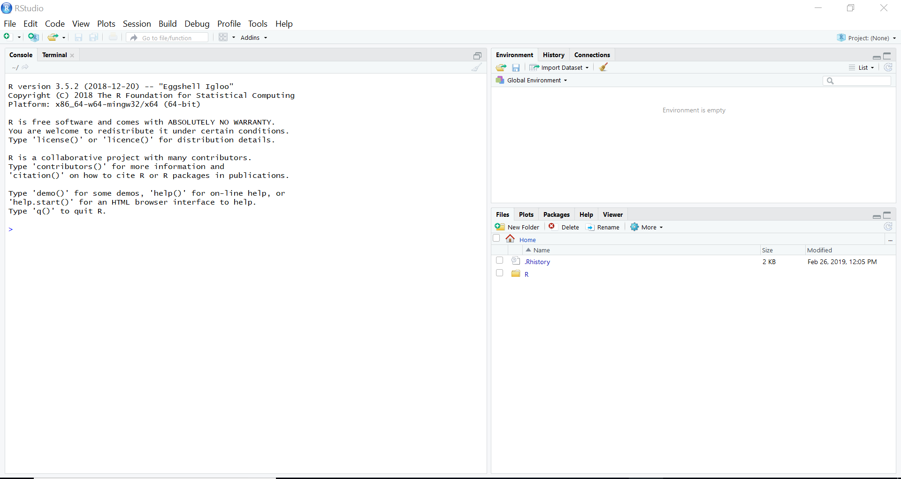
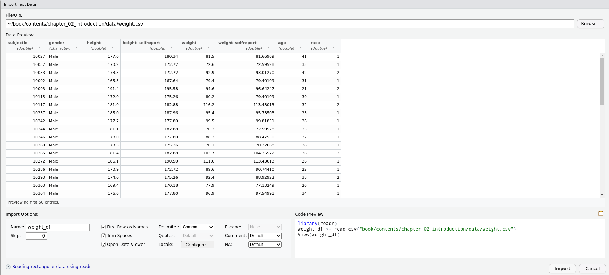

```{r, echo=FALSE}
knitr::opts_chunk$set(echo = FALSE, warning = FALSE, message = FALSE)
options(scipen=9)
```


```{r}
# Use this to calculate number of packages
# And number of open licences
library(tidyverse)

available_packages <- available.packages(repos = "http://cran.us.r-project.org") %>% as_tibble()

open_licences <- str_detect(available_packages$License, 
                            regex('gpl|bsd|mit|apache|cc|GNU|artistic', ignore_case = T)) %>% 
  mean()
```


# What is R, and why should we use it?

While there are many ways of defining what R is, for most practical purposes, it is sufficient to describe R simply as a program for doing statistics and data analysis.
If you've either done any kind of statistics or data analyses, the chances are extremely high that you've used some computer program to do so.
The range of such programs is large.
These include SPSS, SAS, Stata, Minitab, Python, Matlab, Maple, Mathematica, Tableau, Excel, SQL, and many others.
These do not all do the same thing, and so are not necessarily inter-changeable.
Some, like Python, are general purpose programming languages that have become widely used for data science.
 Others, like SQL, are database language.
Others, like SPSS, is primarily a graphical user interface program for statistics, originally targeted at researchers in the social sciences.
R can be seen as just another program in this large and heterogeneous list.
What R's advantages are, however, and what sets it apart from many others programs, comes down to three inter-related factors: it is immensely powerful, it is open-source, and it very and increasingly widely used.
Let us now consider each of these three points further.

## A power tool for data analysis

The range and depth of statistical analyses and general data analyses that can be accomplished with R is immense.

- Built into R's standard set of packages are virtually the entire repertoire of widely known and used statistical methods.
  These include general and generalized linear regression analyses, which themselves include Anovas, t-tests, correlations, etc., descriptive statistical methods, nonparametrics methods, and so on.

- Also built in to R is an extensive graphics library (see the `graphics` package; which is usually termed the "base R" plotting package) for doing virtually the entire repertoire of statistical plots and graphics, and these graphics tools can be combined programmatically to lead to any desired plot or visualization.

- In addition to its built in tools, R has a vast set of add-on or contributed packages.
  There are presently over `r floor(nrow(available_packages)/1000) * 1000` additional contributed packages (to be precise, there are `r nrow(available_packages)` packages as of `r format(Sys.Date(), format='%B %-d, %Y')`).
   While they differ in size, each one will usually provide at least dozens of additional tools and methods for statistics, data manipulation and processing, or graphics.
  Some of these packages could be described as almost mini-languages in themselves.
  For example, and as we'll see below, packages like `ggplot2` is effectively a mini-language for data visualization, while packages like `dplyr` and `tidyr` are effectively mini-languages for data wrangling and manipulation.
  In addition, because R is the de facto standard computing platform for the discipline of statistics, almost every new or existing statistical technique developed by statisticians is made available as a package in R.
  With all of these packages, we are hard pressed to find anything at all related to statistics and data analysis, including data graphics and visualization, that is not currently available in R.

- As large as the set of R packages is, the capabilities of R does not stop here.
  R is a high level and expressive programming language that is specialized to efficiently manipulate and perform calculations or analyses on data.
  This entails that R can be used programmatically to greatly increase the speed and efficiency of any data analysis.
  More importantly, R can be extended by writing custom programs and functions, which may then be packaged and distributed for others to use.
  While writing large or complex extension packages would require some programming skill and experience, programming in R on a smaller and simpler scale is in fact relatively easy, the basics of which can be mastered quickly.
  Given that R is a programming language, there is then effectively no real limit on its capabilities.

- The R programming language itself can be extended by interfacing with other programming languages like C, C++, Fortran, Python, and others.
  In particular, the popular `Rcpp` packages greatly simplifies integrating R with C++, thus allowing fast and efficient C++ code to used seamlessly within R.
  Likewise, R can be easily interfaced with high performance computing or big data tools like Hadoop, Spark, SQL, parallel computing libraries, cluster computing, and so on.

Taken together, these points entail that R is an extremely powerful and extensible environment for doing any kind of statistical computing or data analysis.

## Open source software

R is free and open source software, distributed according to the GNU public license.
Likewise, virtually all of the over `r floor(nrow(available_packages)/1000) * 1000` contributed R packages are likewise free and open source software, with over `r floor(100 * open_licences)`% of them are distributed according to one of the major open source licences, such as GNU, MIT, BSD, Apache, Creative Commons, Artistic.
It is important emphasize the in principle and practical distinctions between free and open source software, on the one hand, and freeware, on the other.
Freeware is proprietary software that is distributed, usually only in binary form and with certain restrictions and conditions, at no monetary cost to the user.
While it can be used in a limited sense at no cost, it can not be extended or developed, its source code can not be viewed, and its non-monetary cost can be revoked at any time.
Free and open source software, on the other hand, is licensed so that anyone can use it and develop it in any manner, including and especially by viewing and extending its source code.
Free and open source software is defined by four essential freedoms [@gnu:philosophy]:

* The freedom to run the program in any manner and for any purpose.
* The freedom to study and modify the source code.
* The freedom to distribute copies of the original code.
* The freedom to distribute modified versions of the code.

In practical terms, the most obvious consequence of R's free and open source nature is that is freely available for everyone to use, on more or less any device they choose.
It is mostly widely used on Windows, Macs, and Linux, but because it is available in open source it can in principle be complied for any platform, and can be used on, for example, Android, iOS, Chrome OS, and many others.
This means that anyone can use R at any time anywhere and always at no cost.
And because of its licence, this will always be the case.

Open source software always has the potential to "go viral" and develop a large self-sustaining community of user/developers.
This is precisely what has happened in the case of R.
Users are drawn in initially because it is available at no cost, can be used on any platform, and has a large number of built-in or add-on tools.
Because R is an open platform, developers such as academic statisticians or data scientists who want to reach a large audience write further add-on packages and make these publicly available.
This draws in more users.
The users themselves may write blogs, books, articles, or teach with R, thus attracting still more users, and so on.

## Popularity

The Journal of Statistical Software[^jss] is the most widely used academic journal describing advances and developments in software for statistics.
While it accepts articles describing methods implemented in a wide variety of languages, it is overwhelmingly dominated by programs written in R.
This fact illustrates that when it comes to the computational implementation of modern statistical methods, R is the de facto standard.

[^jss]: https://www.jstatsoft.org

In an extensive analysis of general data science software [@muenchen:pop], R is ranked as one of the top five most popular data science programs in jobs for data scientists, and in multiple surveys of data scientists, it is often ranked as the first or second mostly widely used data science tool, and the most widely "followed" topics on Quora and LinkedIn.
Likewise, despite being a domain specific language, according to many rankings of widely used programming and scripting languages worldwide, R is currently highly ranked.
R is currently very highly ranked according to many rankings of widely used programming languages of any kind.
For example, the latest RedMonk ratings [@redmonk:2020] place R at rank 13.
The latest TIOBE ratings [@tiobe] place are at rank 8.
The latest PYPL ratings [@pypl] place R at rank 7.

# Installing R and RStudio

Installing R is usually a painless process, but it also usually involves two, or maybe three, separate steps.
First, R itself must be installed.
This will install the R interpreter and also what we'll call R's standard library.
The interpreter is the means by which all our R commands are converted into machine code that is then executed on our machine.
The standard library is the set of built-in packages mentioned above that provide all the basic or most widely used tools for doing statistics, analysis, and visualization.
With that, we will have a fully functioning R environment.
However, by stopping here, the interface through which we'll interact with R will be very minimal and lacking many features that would make our use of R more pleasant and efficient.
As such, the second installation step will be to install the *RStudio Desktop* environment.
This is a very popular interface to R that will greatly transform the ease and efficiency with which we work with R.
Throughout the remainder of this book, we'll assume that we're always working through the RStudio Desktop.
The third installation step is the installation of extra R packages.
As mentioned above, R has over 13,000 add-on packages.
Users can install them on-demand from within R in a manner just like installing apps on a mobile device.
When first installing R, it's often a good idea to also install a minimal set of must-have packages.
After that, additional R packages can be installed as and when they are needed.

We'll now describe how to install R and the RStudio Desktop, and further below, after we describe more about how to use R and RStudio, we will have a separate section on installing R packages.


## Installing R

To install the latest version of R on Windows, go here 
```
https://cran.r-project.org/bin/windows/base/
``` 
For the installer for the latest version of R for Macs, go here 
```
https://cran.r-project.org/bin/macosx/
``` 
For Windows, the installer is an `.exe` file.
For Macs, it is `.pkg` file.
In either case, always go for the installer of the latest R version (which, as of August 2020, is 4.0.2).
we install R with these installers just as we would install any other program on Windows or Macs.

If we're using Linux, we can follow steps similar to the above to get a installer.
However, it is likely that everything will be simpler if we just use our Linux distribution's own package manager and install R with that.
For example, with Debian and Ubuntu based distributions, we can use the `apt-get` package manager, or use the `pacman` installer on Arch Linux, and so on.

## Installing RStudio Desktop

The RStudio Desktop is one of the software products created by the company RStudio.
Although RStudio is a private commercial company, it releases its software under a free and open source licence (namely the GNU Affero General Public License).
It also sells technical support for these products, but this is aimed at companies and organizations rather than individuals.
Simply put, we can use RStudio software just as we use all R software: at no cost, and according to a free and open source licence.
Any prices that are listed for RStudio software are for commercial support.

The webpage  
```
https://www.rstudio.com/products/rstudio/download/
```
provides us with the necessary links to the Windows, Mac, and Linux installers.
Choose the *RStudio Desktop: Free* option, which we will see is listed as under an open source license.
The latest version as of August 2020 is 1.3.1056.
we use the installers here just as we would use any Windows and Mac installers.
For Linux users, there are versions for popular Linux distributions like Ubuntu and Fedora and others.

# Guided Tour of RStudio Desktop

Having installed R and the RStudio Desktop, we can now effectively forget about R.
It is fully installed, and it will be doing all the computing whenever we use RStudio Desktop, but its runs in the background and we don't have to use it directly.
For all practical purposes, it will seem like we are just using a single standalone desktop application.

*A note on terminology*: Strictly speaking *RStudio* is the company that created and maintains the *RStudio Desktop* software, amongst other pieces of software.
In practice, almost everyone, including those who work for RStudio itself, refer to RStudio Desktop simply as RStudio, and we'll do so here as well.
Another product made by RStudio, the RStudio Server, which we'll describe below, is also sometimes called RStudio, but we'll usually explicitly refer to that the RStudio server.

we open RStudio just as we would any other desktop application (e.g. double clicking an icon, typing its name in a launcher, etc), and when we do so, we will be greeted by something that should look exactly like what is shown in Figure \ref{fig:rstudio_when_open_first}.
```{r rstudio_when_open_first, echo=F, fig.cap='The typical layout of the RStudio Desktop when it is opened first.', out.width='\\textwidth'}

```
we will see three main *windows*, which we will describe in more detail below.
For now, we see that to the left, occupying about half the screen by default, is a window with the *Console* pane.
To the right, there are two other windows arranged vertically.
Usually, in fact almost always, we also have two windows on the left.
On top of the window with the console pane, we usually have a script editor.
If it is not present, it can be brought up by the key commands Ctrl+Shift+N (Command+Shift+N on Macs), or by going to the File menu at the top of the screen and choosing *New File > R Script*.
Doing so will create a blank and untitled R script in the script editor window, which will now occupy the upper left quadrant of the screen.
our screen should now look like Figure \ref{fig:rstudio_with_editor}.
```{r rstudio_with_editor, echo=F, fig.cap='RStudio Desktop with R script in upper left quadrant.', out.width='\\textwidth'}
knitr::include_graphics('rstudio_screenshots/rstudio_with_editor.png')
```
We'll now look in more detail at each of these four windows.


Console window

:   The console window usually occupies about half of the left hand side of the screen.
Like all windows, it can be resized with the mouse, or with the window resize buttons to the upper right of each window.
In the console window, by default, there are tabs for three panes: the Console, the Terminal, and Jobs.
The tab for the console is usually the active one.
This is where we type R commands, followed by Enter, and get all our results and output.
It is the single most important part of the RStudio desktop.
We will use it extensively, beginning with our introduction to R commands in the following next section.
The next tab is the Terminal, and this the command line interface to our computer's operating system.
So, on Windows, this is usually the DOS command line.
On Macs and Linux, it is Unix shell, such as the bash shell.
Unlike the console, the terminal is not as widely used.
It may not in fact be used ever, and is only necessary when we need a command line interface to our operating.
The Jobs pane is also not as widely used.
It is for running scripts asynchronously.
     
Script editor window

:   The script editor is where we write scripts of R commands.
We use scripts whenever we want to save our R commands for later re-use, or whenever the R commands are becoming relatively long and complex.
We write here just as we would write in any text file editor (e.g. like notepad), and we can save these files on our computer's file system as normal.
As we'll see below, we can execute or *run* the commands we write in any script either line by line or region by region or by executing the whole script at once.
If we run individual lines or regions, the R code effectively gets copied to the console followed by Enter just as if we copied and pasted from the editor to the console.
We can run the whole script at once, as we'll see below, by using the *source* command, for which there is a button on the upper right of the editor window.

Environment, History etc window

:   In the upper right pane, there are tabs for the Environment, History, and Connections panes.
Sometimes there are other tabs like for Build and Git.
Of these, Environment and History are the more commonly used.
As we'll see as soon as we start using R commands and creating variables, the details of the variables and data structures that are in our current R session are listed in the Environment.
We will have the option of clearing or deleting any or all of these whenever we wish.
Likewise, we may save all of these objects to file, and reload them later.
The Environment window also provides us with a convenient means of importing data files.
The History window provides a list of all the R commands that we have typed.
This is a particularly useful feature as we will see.
It allows us to review everything we have typed in our R session, and allows us to extract out and re-run any commands we want.
We may also save our command history to file at any time.
The other tabs available in this window are not usually used as often.
Connections is used for connecting with databases or clusters, and we will see it again later in the book.
Build, which may not be listed at all, is for building packages or compiling code.
Git, which likewise may not exist, is for version control of our code using Git.
We will talk about using Git for version control in Chapter 6.

Files, Plots, Packages, Help, Viewer window

:   The lower right window provides tabs for browsing files, viewing plots, managing R packages, reading help files, and for viewing html documents.
The *Files* window is a regular file browser, where we can view, create, delete, etc., files and directories.
The *Plots* window is where all figures created during our R session are shown.
If we produce many figures, they are placed in a stack and we can move forward and backward between them.
The *Packages* window, which we will return to in more detail in the next section, lists all our installed R packages.
From here, we can also activate packages for our current R session, as well as install new packages.
The *Help* window displays help pages for any R command or package.
We can browse through these pages, but a particularly useful feature is how we can jump straight through a needed help page for a command or package directly from the R command line or script editor.
We will return to this feature in one of the next sections.
The *Viewer* window is where we can view html pages that are created in RStudio.
These could include *Shiny web apps* or the html pages produced by *RMarkdown* documents.
These are topics to which we will return in later chapters.
     
## Rstudio menus

At the top of the RStudio Desktop there are the following set of menus.


File 

:   The File menu is primarily for the opening, closing and saving of files.
    Often, these files will be R scripts that open in the script editor.
    But they could also be R data file, RMarkdown documents, Shiny apps, etc.
    Here, we can also open and close RStudio *projects*, which is a very useful organizing feature to which we will return below.

Edit 

:   The Edit menu primarily provides tools for standard file editing operations such as copy, cut, paste, and search and replace, undo and redo, etc.
It also provides code folding features, which is very useful for reducing clutter when editing relatively large R scripts.

Code

:   The Code menu provides many useful tools for making editing and running code considerably easier and more efficient.
We will explore these features in more depth in subsequent sections, but they include the adding and removing code comments, reformatting code, jumping to functions within and between scripts, creating code regions that can then be run independently, and so on.


View 

:   The View menu primarily provides options to move around RStudio quickly.
These options are all bound to key combinations, as are many other RStudio features, and learning these key combinations is certainly worthwhile because of the eventual speed and efficiency gains that they provide.


Plots

:   The Plots menu primarily provides features that are also available in the Plots window itself.

Session

:   The Session menu allows us to start new separate RStudio sessions.
These then run independently of one another.
Also in the Session menu, we can restart the R session in the background, which is a useful session.
Remember that RStudio itself is just a front to an R session that runs in the background.
Sometimes it is a good idea to restart the R session so as to start in a clean and fresh state.
This can be done through the Session menu *Restart R* option, which is also bound to the keys Ctrl+Shift+F10.
Also in Session are options to set R's *working directory*.
This concept of a working directory is a simple but important one, and we will cover it below.


Build 

:   The Build menu provides features for running scripts for *software builds*.
This is particularly used for creating R packages.

Debug

:   The Debug menu provides tools for debugging our R code.
Debugging usually only becomes a necessity when R programming per se, and not something that is usually required when writing individual commands or scripts of commands.


Profile

:   The Profile menu provides tools for profiling the running and efficiency of our R code.
Code efficiency is certainly not something that those new to R need to worry about, but when writing relatively complex code, profiling can identify bottlenecks.

Tools

:   The Tools menu provides miscellaneous tools such as for working with version control using Git, accessing the computer's operating system's command line interface, installing and updating packages (as could also be done in the Package window), viewing and modifying keyboard shortcuts.
Here, we can also access the *Global Options* and *Project Options*.
Global Options is where all the general R and RStudio settings are set.
One immediately useful setting here is the *Appearance* setting, which can allow us to change the font, font size, and colour theme of RStudio to suit our preference.
Project Options are for the RStudio project specific settings.
We will return to these below.


Help

:   The Help menu provides much the same information as can be found in the Help window.
It also provides some additional links to online resources, such as RStudio's cheatsheets[^cheatsheets], which are excellent concise guides to many different R and RStudio topics.
Also available in the Help menu are tools to access RStudio internal diagnostics.
This is only that is needed if and when RStudio seems to be malfunctioning.

[^cheatsheets]: https://www.rstudio.com/resources/cheatsheets/

    
# First steps in R

```{r, echo=FALSE}
knitr::opts_chunk$set(echo = TRUE, prompt = TRUE, warning = FALSE, message = FALSE, comment='#>')

# Thanks to 
# https://github.com/ramnathv/slidify/issues/189#issuecomment-15850008
hook1 <- function(x){ gsub("```\n*```r*\n*", "", x) }
hook2 <- function(x){ gsub("```\n+```\n", "", x) }
knitr::knit_hooks$set(document = hook1)

```

R is very a powerful tool.
While it is unquestionably a wonderful thing that everyone can have access to this powerful tool at no monetary cost, now or ever, R's power can also be intimidating and off-putting at the beginning.
People who wish to learn R may simply not know where to begin.
Worse still, some people dive in too deep at the beginning --- tackling some complex analysis before they have a good handle on the basics --- and find things difficult and frustrating, and may then even abandon trying to learn R at all.

To learn R, it is best to learn the fundamentals first. 
In what follows, we have provided sequence of steps that cover many of these.
With each step, we'll introduce some fundamental concepts or tools, and these concepts and tools can build on one another and be combined to lead to yet more concepts and tools.
What we will not cover in these steps are the major topics like data wrangling, data visualization, statistical analyses, etc.
These will be covered in depth in subsequent chapters, and build upon a knowledge of the fundamentals that we cover here.


## Step 0: Using the R console

R is a command based system.
We type commands, R translates them into machine instructions, which our computer then executes, and then we often, but not necessarily, get back some output.
The commands can be typed into the R console, or else they can be put into a script and run as a batch.
When learning R, it is usually best to start with typing commands in the R console.

When we open RStudio initially, our console will usually look something like this:
```
R version 4.0.2 (2020-06-22) -- "Taking Off Again"
Copyright (C) 2020 The R Foundation for Statistical Computing
Platform: x86_64-pc-linux-gnu (64-bit)

R is free software and comes with ABSOLUTELY NO WARRANTY.
You are welcome to redistribute it under certain conditions.
Type 'license()' or 'licence()' for distribution details.

R is a collaborative project with many contributors.
Type 'contributors()' for more information and
'citation()' on how to cite R or R packages in publications.

Type 'demo()' for some demos, 'help()' for on-line help, or
'help.start()' for an HTML browser interface to help.
Type 'q()' to quit R.

> 

```

Notice that at the bottom, there is a single line beginning with `>`.
This is the R console's command prompt, and it is where we type our commands.
We then press Enter, and our command is executed.
The output of the command, if any, is displayed on the next line or lines, and then a new `>` prompt appears.


## Step 1: Using R as a calculator

A useful way to think about R, and not an inaccurate one either, is that it is simply a calculator.
It is useful therefore to learn R by first treating it just like an ordinary handheld calculator, and then learning the ways it extends or goes beyond the capabilities of a calculator.
Just as we would with a calculator, we can start using R by doing arithmetic, i.e. adding, subtracting, multiplying, dividing, and so on.

So, let's start by adding 2 and 2. We do this by typing `2 + 2` at the command
prompt, and then pressing Enter. What we see should look exactly[^1] as follows.
```{r}
2 + 2
```
Notice that the result of the calculation is displayed on the line following the command. That line begins with a `[1]`, and we will return to what this means below but for now it can be ignored.

[^1]: In this document, each line of the console's output begins with `#>`, which will not appear in the actual console.
We use the `#>` just to make it easier to read and to distinguish between the commands that we input into the console and the output that is then displayed.

Now, let's do some more.
Each time, we'll type the command, press Enter, get the result, and then a new `>` prompt occurs, and we type the next command and so on.
So calculating the sum of 3 and 3, 4 and 5, 10 and 17 and 5 will lead to the following:
```{r}
3 + 3
10 + 17 + 5
```

*Using history*: Before we proceed, take a look at our *History* window.
It should look like this:
```
2 + 2
3 + 3
10 + 17 + 5
```
In other words, it is a list of everything we've just typed.
If we click on any line here, we will select it.
If we then click `To Console`, this line will be copied to the console, and we can press Enter to re-execute.
More usefully, we can move through our history with the Up and Down arrow keys on our keyboard.
Repeatedly pressing the Up arrow key will bring up the list of each command we just typed, and repeatedly pressing the Down arrow key will bring us back down.
At any point as we go through the list, we can press Enter to re-run that command, which then adds that command on to the end of the History.

Let's look at some more arithmetic.
For *subtraction*, we use the `-` symbol. 
```{r}
5 - 3
8 - 1
```
Multiplication uses the asterisk symbol `*`.
```{r}
5 * 5
2 * 4
```
Division uses the `/` symbol.
```{r}
1 / 2
2 / 7
```
Exponents, i.e. raising a number to the power of another number, is accomplished with the caret symbol `^`.
```{r}
2 ^ 8
10 ^ 3
```
Exponents also work by `**`, but this is less common.
```{r}
2 ** 8
10 ** 3
```
Just like on a calculator, we can combine the `+`, `-`, `*`, `/`, `^` operators in any commands.
```{r}
2 + 3 - 6 / 2
10 * 2 - 3 / 5 ^ 2 
```
Note that precedence order of operations will be `^` followed by `*` or `/` followed by `+` or `-`, and just like on a calculator, we can use round brackets
to control the order of operations.
```{r}
2 / (3 * 2)                
(2 / 3) * 2
```
In the above, we were always dealing with positive values.
However, we can always precede any number with a `-` to get its negative value.
```{r}
-2 * 3
10 ^ -3
```


Notice that throughout all the above above commands, we put a space between around the `+`, `-`, `*`, `/`, `^` operators.
This is a matter of recommended style to improve readability, not a requirement.
In other words, the following all work in exactly the same way.
```{r}
2+3
2+     3
2  +   3            
```
It is just recommended to use the `2 + 3` version.
On the other hand, while it is also possible to have spaces after the `-` sign that we use to negate a value, the recommended style is to not do so, and so we use `3 / -2` and not `3 / - 3`, though both will do the same thing.


## Step 2: Variables and assignment

A major step forward in using R, and a major step beyond the capabilities of a handheld calculator, is the use of variables and the assignment of values to variables.
In effect, this simply allows us to store the values of calculations for later use, but that in fact is a very powerful thing.

Consider what happens when we type the following at the command prompt and then press Enter.
```{r}
(12 / 3.5) ^ 2 + (1 / 2.5) ^ 3 + (1 + 2 + 3) ^ 0.33
```
All the constituent numbers are stored in our computer's memory, calculations are done on them, and then the result is stored in memory.
This is then displayed as the output on our screen, and because nothing further needs to be done with it, it is removed from memory.
We can, however, keep this value stored in memory by *assigning* it to a variable.
We do this with the *assignment operator* `<-`, which is a `<` symbol followed directly by a `-` symbol. 
The `<-` can be typed by key combination Alt+- (i.e Alt key and minus key together) or Option+- on the Mac. 

So if we want to assign the value of the above calculation to a variable named `x`, we would do
```{r}
x <- (12 / 3.5) ^ 2 + (1 / 2.5) ^ 3 + (1 + 2 + 3) ^ 0.33            
```
Notice that on pressing Enter here, there is no output on screen. 
The calculation is done as normal but rather than outputting it to the screen, the value is assigned to the variable named `x`. 
If we now type the name `x` at the prompt, its value will be displayed.
```{r}
x
```
We can then do calculations with this variable just like we would with any other number
```{r}
x ^ 2
x * 3.6
```
And we can assign any of these values to new variables.
```{r}
y <- x ^ 2
y <- x * 3.6
```

In general, the assignment rule is 
```
name <- expression
```
The `expression` is any R code that returns some value.
This could be the result of a calculation, as in the above examples, but it could also be the "output", or result, of some complex statistical analysis, which is something we will see repeatedly in later sections and chapters.
In the simplest case, it could also be just a single numeric or other value, e.g.,
```{r}
x <- 42
```
The `name` has to follow certain naming conventions.
In all the above examples, we used a single lowercase letter, but in general it can consist of multiple characters.
Specifically, it can consist of letters, which can be either lowercase or uppercase, numbers, dots, and underscores.
It must, however, begin with a letter or a dot that is not followed by a number.
So all of the following are acceptable.
``` 
x123
.x
x_y_z
xXx_123
```
But all of the following are *not* acceptable.
``` 
_x
.2x 
x-y-z
```
Although many names like `x123` etc. are valid names, the recommendation is to use names that are meaningful, relatively short, without dots (using the underscore `_` instead for punctuation), and primarily consisting of lowercase characters.
Examples like the following are recommended.
```{r}
age <- 29
income <- 38575.65
is_married <- TRUE
years_married <- 7
```

## Step 3: Vectors

Up to now, all the values we've been dealing with have been single values. 
In general, we can have variables in R that refer to collections of values.
These are known as *data structures*. 
There are many different types of data structures in R, but the two that we encounter most often are *vectors* and *data frames*. 
Data frames are probably the single most important data structure in R and are the default form for representing data sets for statistical analyses. 
But data frames are themselves collections of vectors, and so vectors are a very important fundamental data structure in R.
In fact, as we will see, single values like all those used above, are actually vectors when exactly one element.

Vectors are one dimensional sequences of values. 
While they will often be created for us by the R functions that we use, such as by some data analysis functions, we can also create vectors ourselves using the the `c()` function. For example, if we want to create a vector of the first 10 primes numbers, we could do the following.
```{r}
primes <- c(2, 3, 5, 7, 11, 13, 17, 19, 23, 29)
```
To use the `c()` function, where `c` stands for *combine*, we simply put within it a set of values with commas between them.

### Vector operations

We can now perform operations, like those we saw above, on the `primes` vector just as we would to a single valued variable.
For example, we can do arithmetic operations.
```{r}
primes + 1
primes / 2
primes ^ 2
```
In these cases, the operations are applied to each element of vector. 

### Indexing

For any vector, we can refer to individual elements using indexing operations.
For example, to get the first or fifth elements of `primes`, we would use square brackets as following.
```{r}
primes[1]
primes[5]
```
If we want to index sets of elements, rather than just individual elements, we can use vectors (made with the `c()` function) inside the indexing square brackets.
For example, if we want to extract the 7th, 5th, and 3rd elements, in that order, we can do the following.
```{r}
primes[c(7, 5, 3)]
```
If we want to refer to a consecutive set of elements, such as the second to the fifth elements, we can do the following.
```{r}
primes[2:5]
```
In R, the expression `n:m`, where `n` and `m` are integers, gives us the vector of integers from `n` to `m`.
So, for example, `2:5` means the same thing as `c(2, 3, 4, 5)`.

If we use a negative valued index, we can refer to or all elements *except* one.
For example, all elements of `primes` except the first element, or except the second element, can be obtained as follows.
```{r}
primes[-1]
primes[-2]
```
If we precede a vector of indices by a minus, we'll return all elements except those in the index vector.
For example, we can get all elements except the third, fifth, or seventh elements as follows:
```{r}
primes[-c(7, 5, 3)]
```

### Single valued vectors 

R, unlike some other programming languages, does not represent single values as elementary data types.
Single values are in fact just vectors with only one element, and so can be indexed, and so on, just like any other vector.
```{r}
x <- 42
x[1]
```

### Character vectors

Our `primes` vector is a sequences of decimal numbers.
We can verify this by applying the `class` function to the vector and seeing that it is a `numeric` vector.
```{r}
class(primes)
```
We can, however, have many other types of vectors.
For example, we can have character strings, i.e. string of characters that are surrounded by quotation marks.
These are, in fact, very widely used in R.
For example, here's vector of the names of the six nations.
```{r}
nation <- c('ireland', 'england', 'scotland', 'wales', 'france', 'italy')
```
This vector is of type `character`, which we can verify as follows.
```{r}
class(nation)
```
Note that we can use single or double quotation marks for each string, as in the following example.
```{r}
nation <- c("ireland", 'england', "scotland", 'wales', 'france', 'italy')
```
Just like numeric vectors, we can index character vectors.
```{r}
nation[1]
nation[-2]
nation[4:6]
```
We can not, however, perform arithmetic functions on character vectors.
We will obtain an error if we try.
```{r, error=T}
# does not work
nation + 2
nation * 2 
```
### Logical vectors

Another widely used type of vector is a logical or Boolean vector.
A Boolean variable is a binary variable that takes on values of true or false.
In R, these values are represented using "TRUE" or "T" for true, and "FALSE" or "F" for false.
For example, a vector of values representing whether each of a set of five people is male or could be as follows.
```{r}
is_male <- c(TRUE, FALSE, TRUE, TRUE, FALSE)
```
This could also be created more succintly as follows.
```{r}
is_male <- c(T, F, T, T, F)
```
Using `class`, we can verify that this vector is a logical vector.
```{r}
class(is_male)
```
We can index logical vectors just like numeric or character vectors.
```{r}
is_male[2]
is_male[c(1, 2)]
```
Arithmetic operations on logical vectors can be applied to logical vectors, but only by first converting "TRUE" and "FALSE" to the number 1 and 0, respectively.
```{r}
is_male * 2
is_male - 2
```
The vector returned by operations like this is a numeric vector.
```{r}
result <- is_male * 2
class(result)
```

We can also apply Boolean or logical operations to logical vectors.
These logical operations are *and*, *or*, and *not*.
The *and* operator tests if two logical values are both true. 
In R, it is represented by `&`.
```{r}
TRUE & FALSE
TRUE & TRUE                
```
In these example, we have a single Boolean variables on either side of the `&`, but given that a single value is a vector of one element, we could also apply the `&` to vectors of multiple elements.
```{r}
c(T, F, T) & c(T, T, F)
```
In this case, the `&` operation is individually applied to the first, second, and third elements of both vectors.
The *or* operator tests if one or the other is true, and is represented by the `|` character.
```{r}
TRUE | FALSE
TRUE | TRUE
```
We can negate a logical value by using the `!` operator.
```{r}
!TRUE
!FALSE
```
Just as we can combine arithmetic operations, so too can we combine logical operations, using brackets 
to control the order of operations if necessary.
```{r}
(TRUE | !TRUE) & FALSE
(TRUE | !TRUE) & !FALSE
```

### Equality/inequality operations

Equality and inequality operations can be applied to different types of vectors, and also return logical vectors.
For example, we can test if each value of a vector of numbers, such as `primes`, is equal to a specific value as follows.
```{r}
primes == 7
```
Again, given that a single value is a vector of one element, we can also apply this operator to individual values.
```{r}
12 == (6 * 2)
```
And we can test if values are not equal with `!=`.
```{r}
12 != (6 * 2)
primes != 3
```
We can test if numbers are less than, or greater than, another number with the `<` and `>` operators, respectively.
```{r}
primes < 5
primes > 8
```
We can test if numbers are less than or equal to, or greater than or equal to, another number with the `<=` and `>=` operators, respectively. 
```{r}
primes <= 7
primes >= 3
```

We can also apply equality or inequality operations to character vectors.
```{r}
nation == 'england'
nation != 'england'
```
The meaning of some inequality operations, such as the following, may be initially unclear.
```{r}
nation >= 'italy'
```
In this case, greater than or less than is defined by alphabetical order, and so `nation >= 'italy'` is evaluating whether each listed nation is alphabetically after, or the same as, the string `italy`.


### Coercing vectors

An important property of all vectors is that they are homogeneous, in that all their elements must be of the same data type. 
For example, we can't have a vector with some numbers, some logical values, and some characters. 
If we try to make a heterogeneous vector like this, some our elements will be *coerced* into other types. 
If we, for example, try to combine some logical values with some numbers, the logical values will be coerced into numbers (`TRUE` will be converted to `1`, `FALSE` will be converted to `0`).
```{r}
c(TRUE, FALSE, 3, 2, -1, TRUE)
```
If we try to combine numbers of logical values with character strings, they will all be coerced into strings, as in the following example.
```{r}
c(2.75, 11.3, TRUE, FALSE, 'dog', 'cat')
```

### Combining vectors 

Just as we combined numbers or other single values into vectors using the combine, i.e., `c()` function, so too can be combine vectors with `c()`.
For example, to combine the `primes` vector, with the vectors that are the squares and cubes of `primes`, we would do the following:
```{r}
c(primes, primes^2, primes^3)
```
In this case we have produced a vector of 30 elements.
These don't all fit on one lines and so are wrapped over three lines.
The first row displays elements 1 to 11.
The second row begins with the twelfth element, and the third row begins with the 23rd element.
Now, we can see the meaning of the `[1]` on the output that we encountered in all of the above examples.
The `[1]` is merely the index of the first element of the vector shown on the corresponding line. 


### Named vectors

The elements of a vector can be named. For example, we could provide names to our elements when we create the vector as in the following example.
```{r}
ages <- c(bob = 27, bill = 19, charles = 24)
ages
```
We can access the vector's values now by their names as well as by an index as before.
```{r}
ages['bob']
ages['bill']
```
If we have an already existing vector, we can add names using the `names` function as in the following example.
```{r}
ages <- c(27, 19, 24)
names(ages) <- c('bob', 'bill', 'charles')
ages
```

### Missing values

In any vector, regardless of its type, there can be missing values.
In R, missing values are denoted by `NA`, which can be typed inserted explicitly into any vector as in the following examples.
```{r}
x <- c(1, 2, NA, 4, 5)
x
y <- c('be', NA, 'afeard')
y
```
The `NA` here is not a character a string.
It is a special symbol with a special meaning in R.
In other words, there is an important difference between the following two vectors.
```{r}
c(1, 2, NA, 4, 5)    # this is a numeric vector, but with a missing value
c(1, 2, 'NA', 4, 5)  # the "NA" coerces this to be a character vector
```


## Step 4: Data frames

The data frame is probably the most important data structure in R.
As mentioned, data frames are how we almost always represent real world data sets in R, and most statistical analysis commands, especially modern ones, assume data is provided in the form of data frames. 
We will provide a much more comprehensive coverage to data frames in subsequent chapters, but for now, we'll describe some of their essential features.

Data frames are rectangular data structures: they have certain number of columns, and each column has the same number of rows. 
Each column is in fact a vector, and so data frames are essentially collections of equal length vectors.

Usually, data frames are created when read in the contents of a data file, such as a `.csv` or `.xlsx` file.
However, for the purposes of introduction, we can produce them on the command line with the `data.frame()` function as in the following example.
```{r}
data_df <- data.frame(name = c('billy', 'joe', 'bob'), age = c(21, 29, 23))
data_df
```
As we can see, this created a data frame with 3 rows and 2 columns.
The columns are variables, and the rows are the observations of these variables.

We can refer to the elements of a data frame in different ways.
The simplest is to use double indices, one for the rows, one for the columns.
For example, to refer to the element in the third row of the second column
```{r}
data_df[3, 2]
```
We can refer to the first and third row of the second column by using a vector of indices for the rows
```{r}
data_df[c(1, 3), 2]
```
We can refer to all the elements of the third row, by leaving the second index blank.
```{r}
data_df[3, ]
```

We have more options available if we want to refer to one or more columns.
We could, for example, use the double indices, leaving the first index blank to refer to all rows.
For example to refer to the second column, we would do the following.
```{r}
data_df[,2]
```
One the other hand, we could also refer to the column by name.
To do so, we could use the following `$` notation.
```{r}
data_df$age
```
Here, `age` can be seen as a property of `data_df`, and so `data_df$age` accesses this property. 
An alternative syntax that accomplishes the same thing is to use
*double* square brackets as follows.
```{r}
data_df[['age']]
```
If, one the other hand, we were to use a *single* square brackets, we would obtain the following.
```{r}
data_df['age']
```
This is a subset of `data_df` that is itself a data frame.

## Step 5: Other data structures

So far we have met vectors and data frames. 
These are probably the most commonly encountered data structures in R but there are others.
Here is a brief overview.

### Lists

Lists in R allow for the storage of multiple heterogeneous data structures. 
As an example, the list in the following example contains three vectors of different types, and with different number of elements.
```{r}
example_list <- list(A = TRUE, B = c(1, 2, 3), C = c('cat', 'dog'))
example_list
```
We can refer to the elements of the list just as we would refer to the variables of a data frame, which is not surprising given that in fact data frames are ultimately lists of vectors of the same length.
```{r}
example_list[['B']]
example_list$B
example_list[[1]]
```

### Matrices

Matrices are equivalent to 2-dimensional vectors. 
They contain homogeneous data types and are arranged in a rectangular $n\times m$ format, where each of the $n$ rows has exactly $m$ columns, and each of the $m$ columns have exactly $n$ rows.
In the following example, we put the first 10 primes in a matrix of 2 rows and 5 columns.
```{r}
matrix(c(2, 3, 5, 7, 11, 13, 17, 19, 23, 29), nrow=2, ncol=5)
```
Notice how the elements were arranged by columns first (i.e. the first `primes` element is in the first row and first column, the second element is in the
second row of the first column, and so on).
Alternatively, we can arrange the elements by rows as follows.
```{r}
matrix(c(2, 3, 5, 7, 11, 13, 17, 19, 23, 29), byrow = T, nrow=2, ncol=5)
```

We may also create matrices by *binding* vectors by rows or columns.
For example, we may stack vectors as rows on top of one another by an `rbind` operation as follows.
```{r}
rbind(c(1, 2), c(3, 4))
```
Alternatively, we may stack them as columns side by side.
```{r}
cbind(c(1, 2), c(3, 4))
```

We can index the elements, rows, and columns in a matrix similarly to how we did so in the case of data frames.
```{r}
primes_m <- matrix(c(2, 3, 5, 7, 11, 13, 17, 19, 23, 29), byrow = T, nrow=2, ncol=5)
primes_m
```
Here, we index a single element, all elements of a row, or all elements of column, respectively.
```{r}
primes_m[1, 3]   # row 1, column 3
primes_m[2, ]    # row 2, all cols
primes_m[, 3]    # column 3, all rows
```

Matrix algebra operations, such as matrix inverse and inner or outer products, may be applied to R matrices.
We will not discuss this operations further here but will return to them as we encounter them in later chapters.

*Arrays*: Arrays are n-dimensional generalizations of matrices, which are strictly 2d data structures.
We can create an array in a similar manner to how we created matrices, as in the following examples.
```{r}
example_array <- array(c(1, 2, 3, 4, 5, 6, 7, 8), dim=c(2,2,2))
example_array
```
We can index arrays just as we did with matrices, but now with three indices, as in the following examples.
```{r}
example_array[1,2,]
example_array[,1,]
```


## Step 6: Functions

While data structures hold data in R, functions are used to do things to or with the data.
In almost all functions, we put data structures in, calculations or done to or using this data, and new data structures, perhaps just a single value, are then returned.
So far, we have seen two functions: `c()`, which combines vectors, and `data.frame()`, which creates data frames.
Altogether, across all R packages and R's standard library, there are at least tens of thousands of functions available in R, and probably many more.
That, of course, is an overwhelmingly large list, but at the start all we need to know is a relatively small set, and we then learn more gradually as we continue to use
R.

To explore some functions, we'll use our `primes` vector above.
We can count the number of elements in the vector as follows.
```{r}
length(primes)
```
We can get the sum, mean, median, standard deviation, variance as follows.
```{r}
sum(primes)
mean(primes)
median(primes)
sd(primes)
var(primes)
```

### Nested functions

We can nest functions as in the following example.
```{r}
round(sqrt(mean(primes)))
```
Here, we first calculate the mean of `primes`, then get its square root using `sqrt`, and then round the result using `round`. 

### Optional arguments

In all above the above examples, the functions take a single vector of any length as their input *argument*, and return a single value (vector of length one) as its output.
In some cases, function make take additional arguments, which if left unspecified are given default values.
For example, `mean()` takes an additional `trim` argument, which trims out a certain proportion of the extreme values of the vector, and then calculates the mean.
By default, the value of `trim` is 0, meaning that no trimming is done by default.
If, on the other hand, we want to trim out 10% of the highest and lowest values, we would set `trim` to `0.1` as follows. 
```{r} 
mean(primes, trim=0.1)
```

### Function help pages

Knowing that `mean()` takes an additional optional argument `trim`, and what `trim` does and what is its default values, can be discovered from the help page for `mean()`. 
In fact, all functions will have a help page, which will usually tell us exactly what should go in to the function and what comes out, what the function does, and it usually also provides examples of its use. 
We can always access the help page of a function by preceding the function's name with `?` and pressing enter.
```{r, eval=F, echo=T}
?mean
```
This is equivalent to typing `help()` with function's name inside.
```{r, eval=F, echo=T}
help("mean")
```
Another alternative is to press the F1 key when our cursor is on the function's name on the console. 

### Custom functions

R makes it easy to create new functions. 
We will return to making custom functions in Chapter 6, but for now here is an example of a function that calculates the arithmetic mean.
```{r}
my_mean <- function(x){ sum(x)/length(x) }
```
Of course, the function `mean` already exists so there is little need for a custom function that does the same thing.
However, it serves as a simple example of how to make a function.
As can be easily surmised, `my_mean` takes a vector as input and divides its sum by the number of elements in it.
It then returns this values. 
The `x` is a placeholder for whatever variable we input into the function.
We would use it just as we would use `mean`.
```{r}
my_mean(primes)
```

## Step 7: Scripts

Scripts are files where we write R commands, which can be then saved for later use. 
We can bring up RStudio's script editor with Ctrl+Shift+N, or go to the *File > New File > R script*, or click on the  icon on the left of the taskbar below the menu and choose R script.

### Executing code in scripts

In the script in the editor, we can write any R commands that could be written and executed in the console.
Unlike in the console, when we press Enter after a command we type in the editor, the command is not executed.
All Enter does is move the cursor on to the next line in the script, just as would happen in any text or code editor. 
If we want to run a command, place the cursor anywhere on the line, and click the  Run icon.
This will effectively copy the line to the console and run it there.
we can achieve the exact same effect by pressing Ctrl+Enter.
That is, we place the cursor anywhere on line, press Ctrl+Enter, and it will be copied to the console and executed.

In a script, we can have as many lines of code as we wish, and there can be as many blank lines as we wish.
For example, our script could consist of the following lines.
```{#numCode .R .numberLines}
composites <- c(4, 6, 8, 9, 10, 12, 14, 15, 16, 18)

composites_plus_one <- composites + 1

composites_minus_one <- composites - 1
```
If we place the cursor on line 1, we can then click the  Run icon, or press the Ctrl+Enter keys.
The line is then copied to the console and executed, and then the cursor jumps to the next line of code (line 3).
We can then click  Run or press Ctrl+Enter again, which copies line 3 to the console and executes it, and then the cursor moves to line 5.
This way, we can step through a long list of commands, executing them one by one, by just repeatedly click the  Run icon, or repeatedly pressing Ctrl+Enter.

In addition to running the commands in our script line by line, we can select multiple lines with our mouse and again press the  Run icon, or press Ctrl+Enter.

We may also run the entire script at once. This is known as *sourcing* the script.
We may accomplish this by pressing the  Source icon on the left of the editor's task bar.
This then runs a `source()` command on the console with the name (or temporary name) of our script.

### Multiline commands

One reason why writings in scripts is very practically valuable, even if we don't wish to save the scripts, is when we are write long and complex commands.
For example, let's say we are creating a data frame more than a few variables and more than a few observations per variable.
In this case, we can split the command over multiple lines as in the following example.
```{.R .numberLines}
Df <- data.frame(name = c('jane', 'joe', 'billy', 'bob', 'jim'),
                 age = c(23, 27, 24, 32, 19),
                 sex = c('female', 'male', 'male', 'male', 'male'),
                 occupation = c('doctor', 'tinker', 'tailor', 'soldier', 'spy')
)
```
We can execute this command as if it were on a single line by placing the cursor anywhere on any line and pressing the  Run icon, or repeatedly pressing Ctrl+Enter.

When writing multiline commands, it is advisable that we use consistent indentation to increase readability.
The following multiline command will work perfectly, but it is more difficult to read, and perhaps to edit too.
```{.R .numberLines}
Df <- data.frame(name = c('jane', 'joe', 'billy', 'bob', 'jim'),
age = c(23, 27, 24, 32, 19),  
                             sex = c('female','male', 'male', 'male', 'male'),
           occupation = c('doctor', 'tinker', 'tailor', 'soldier', 'spy')
)
```
We can always get improved and consistent indentation by highlighting all our lines and then going to the *Code* menu, and selecting *Reindent Lines*.
More efficiently, we can accomplish the same thing by highlighting the lines and then pressing Ctrl+I.


### Comments

An almost universal feature of programming language is the option to write *comments* in the code files.
A comment allows us write to notes or comments around the code that is then skipped over when the script or the code lines are being executed.
This is particularly useful to write explanatory notes to ourself or to others.
In R, anything following the `#` symbol on any line is treated as a comment.
Any line starting with `#` will be ignored completely when the code is being run, and we can place a `#` at any point on a line, and anything written after it is also ignored.
The following code shows some examples of the use of comments.
```{.R .numberLines}
# Here is a data frame with four variables.
# The variables are name, age, sex, occupation.
Df <- data.frame(name = c('jane', 'joe', 'billy', 'bob', 'jim'),
                 # This line is a comment too.
                 age = c(23, 27, 24, 32, 19), # Another comment. 
                 sex = c('female','male', 'male', 'male', 'male'),
                 occupation = c('doctor', 'tinker', 'tailor', 'soldier', 'spy')
)

```

### Code sections

We can use comments to divide up a script into sections as in the following example.
```{.R .numberLines}
# Create vectors ----------------------------------------------------------

primes <- c(2, 3, 5, 7, 11, 13, 17, 19, 23, 29)
composites <- c(4, 6, 8, 9, 10, 12, 14, 15, 16, 18)


# Some calculations -------------------------------------------------------

primes_plus_one <- primes + 1
composites_squared <- composites ^ 2


# Some more calculations --------------------------------------------------

primes_lt_20 <- primes[primes < 20] # prime numbers less than 20

```
In this example, we have created three code sections, each one defined by the section header that begins with `#` and ends with a sequence of dashes `----`.
We can always create a new section with *Code -> Insert Section*, or the key command Control+Shift+R.
In general, however, for the RStudio editor, a code section is demarcated by any line beginning with `#` and any with at least four dashes `----`, equal signs `====`, or hashes `####`.

On the one hand, a section is nothing but a set of lines preceded by a commented line that read like a section header.
This, of course, helps to make the code readable.
However, RStudio recognizes these sections as distinct units of the script.
For starters, we can jump between sections by selecting the name of the section listed when we press the  icon at the bottom left of the editor.
We can also bring up the list of sections by Alt+Shift+J.
In addition, the  icon in the top right corner of the editor provides a list of our sections, which we can jump to by clicking.
For short scripts, jumping between sections does not offer much in terms of efficiency, but this feature  is particularly useful for moving between sections in longer scripts.

We may also collapse or expand any of our sections.
For example, if our cursor is within the `Some calculations` section above, you can do *Edit > Folding > Collapse* to hide the contents of this section.
This can also be accomplished with the keyboard shortcut Alt+L. 
We can expand or uncollapse the section with  *Edit > Folding > Expand*, which can also be done with Alt+Shift+L.
We can collapse all sections simultaneously with *Edit > Folding > Collapse All*, or Alt+O, and expand all sections simultaneously with *Edit > Folding > Expand All*, Alt+Shift+O.

Another particularly useful feature of code sections is we may also run all the code in a section with *Code > Run Region > Run Code Section*, or else with Control+Alt+T shortcut.

### Saving a script

We save a script just like we would save any other file. 
On the editor, there's a  button at the top left of the editor window.
Likewise, we can do *File > Save*, which is mapped to the Ctrl+S keyboard shortcut.
The resulting file is just a text file, and not some special format that can only be read by R or RStudio.
In can be opened in any of the countless programs that can open text files.
In principle, it can be named anything we like.
However, it is recommended that we only use lower case letters, numbers, and underscores --- so no spaces or hyphens or dots --- and that it should always end with the file extension `.R`. 
The `.R` file extension is automatically included if it is not already there when we save a script using RStudio.

## Step 8: Installing and loading packages

As mentioned above, there are over `r floor(nrow(available_packages)/1000) * 1000` add-on R packages as of `r format(Sys.Date(), format='%B, %Y')`.
These are installed on demand, just as one installs apps on a mobile device. 
The easiest way to install packages is from the *Packages* pane, which is in the lower right window, see left image in Figure \ref{fig:packages_pane}.
There we will see a listing of all the R packages that are currently installed on our system. 
In the top right of the window, there is the  button.
This refreshes the listing to make sure that any very recently installed packages are also shown in the listing.
The packages are always listed alphabetically, so we can browse through the list to see if what we want is already there.
There is also a search box, which is in the top right.
Start typing the name of any package there and the package listing will be filtered to match what we type.

```{r packages_pane, echo=F, fig.cap='Left: The packages pane in the RStudio Desktop, which is by default in the lower right right quadrant window. Right: The install packages dialog box that appears when we press the \\emph{Install} button in the upper left of the packages pane.', out.width='0.45\\textwidth', fig.show="hold", fig.align='center'}
knitr::include_graphics(c('rstudio_screenshots/packages_pane.png', 
                          'rstudio_screenshots/install_packages.png'))
```

To install a package, click the  Install button on the top left. 
This will bring up a dialog box (see right image in Figure \ref{fig:packages_pane}) where we can type in the packages that we want.
As soon as we start typing in the box for the package names, packages matching the characters we've typed will be shown.
From this, we can select what we want.
We can type the names of multiple packages into the install packages dialog box, separating them with a space or a comma.
When we click *Install*, we will notice that commands are run in our console.
For example, if we install the package `dplyr`, we will see the following command appear in our console, which will then automatically execute.
```{r, eval=FALSE}
install.packages("dplyr")
```
If we select multiple packages to install --- for example, `dplyr`, `tidyr`, and `ggplot2` --- then the same `install.packages` command is run, but with a vector of names as the input argument.
```{r, eval=FALSE}
install.packages(c("dplyr", "tidyr", "ggplot2"))
```
Given that the install packages dialog box just runs these commands, we can always type them directly into the console ourself.

As soon as these commands are executed, we will see the progress of the installation in the R console.
There, in the top left, a  will be shown when the installation is occurring and we will see activity happening in the console.
When the installation is complete, the stop sign will disappear and the normal `>` command prompt will return to the console.

### Which packages to install? 

A common question, especially when learning R initially, concerns which packages should we install? 
There is no general answer to this question because it heavily depends on the type of analyses we need to do or the type of data we will be working with. 
However, we highly recommend always installing the [`tidyverse`](https://www.tidyverse.org/) collection of packages. 
The tidyverse describes itself as "an opinionated collection of R packages designed for data science ... (that) share an underlying design philosophy, grammar, and data structures."
We will use these packages extensively from now on in this book. 

Although `tidyverse` is a collection of packages, and these packages can be individually installed, they can also be installed en-masse by typing *tidyverse* into the install packages dialog box, or alternatively by typing the following in the console.
```{r, eval=FALSE}
install.packages('tidyverse')
```

### Updating packages

R packages are downloaded from the *Comprehensive R Archive Network* (CRAN), which is a network of mirror servers that serve out R software and are distributed around the world.
We can always check for any updates to our installed packages using the  Update button at the top of our Packages window.
This will list any packages with versions that are more recent that those you have installed.
We can then update some or all of these packages. It is generally a good idea to periodically check for updates and update all packages if necessary. 


### Loading packages

Having installed any package, it is now available for use in any R session.
However, it needs to be activated or loaded for this to happen. 
In other words, our installed packages can only be used when they are loaded into our R session.
We can load them by clicking on the tick box next to the package name in the Packages listing.
Unticking the package will deactivate or unload it.
We will notice that when to tick or untick this box, a `library()` command is run on the console.
This can always be typed directly, rather than clicking the tick box.
For example, to load all the `tidyverse` packages, do
```{r, eval=FALSE}
library("tidyverse")
```
Throughout the remainder of this book, we will be using many packages, and we will always load them from a `library()` command run on the console.

### Package masking

When we load a package, we are often greeted with messages like the following.
```{r, eval=FALSE}
library("dplyr")
```
```
Attaching package: dplyr

The following objects are masked from package:stats:

    filter, lag

The following objects are masked from package:base:

    intersect, setdiff, setequal, union
```

What this means that the `dplyr` package has loaded up two functions, `filter` and `lag`, that were previously loaded by the `stats` package, and four other functions, `intersect`, `setdiff`, `setequal`, and `union`, that were loaded previously by the `base` package.
Both the `stats` and the `base` packages are loaded by default in any R session.
If we now try to use, for example, `filter`, we will be given `filter` function of `dplyr` rather than the `stats` package's `filter` function.
In general, R searches for functions according to its *search path*, which we can see with the following command.
```{r, echo=F}
library("dplyr")
```
```{r}
search()
```
So, for example, if we search for a function named `filter`, we will find the `filter` in `dplyr` first, because `dplyr` is nearer the start of the search path than the `stats` package. 
This does not mean that the masked functions are unavailable.
We can access them directly using the `<package name>::<function name>` syntax as in the following examples.
```{r, eval=F}
stats::filter()      # The `filter` function in the `stats` package.
base::intersect()    # The `intersect` function in the `base` package.
```

## Step 9: Reading in and viewing data

We mentioned that when we are dealing with real data sets in R, we almost always read them in to R from files. 
R allows us to import data from a very large variety of data file types, including from other statistics programs like SPSS, Stata, SAS, Minitab, and so on, and common file formats like `.xlsx` and `.csv`.
Here, we'll just look at the example of importing `.csv` files, which is a particularly common scenario anyway, and the procedure we follow for importing the other file formats is similar.

When learning R initially, the easiest way to import data is using the  *Import Dataset* button in the *Environment* pane.
This will give us options to import from a number of different file types. 
If we are importing `.csv`, we can choose either *From Text (base)...* or *From Text (readr)...*.
The former option imports the `.csv` file using the function `read.csv()`, which part of the *base R* set of packages.
The latter option uses the `read_csv()` function from the `readr` package, which is part of the `tidyverse` package collection. 
Throughout this book, we recommend always using `tidyverse` over *base R* functions whenever the options are available, and so we will use the *From Text (readr)...* option always for importing `.csv` files.

Upon choosing the *From Text (readr)...* option, if the `readr` package is not yet installed, we will be asked if to install it.
However, it will already be available for us if we installed `tidyverse`, as described in the previous step.
We will then be given a typical file import dialog box, just as we would encounter in many other programs, see Figure \ref{fig:read_csv}.
There we choose the file we want to use using a file browser.
At the bottom left of the dialog box, there are various options about how to parse the `.csv` file.
Often we can use leave these at their default values. 
However, it is often a good idea to explicitly choose a new *Name* for the data frame into which the contents of the `.csv` will be read.
By default, the name of the data frame will be the file name, but often it is preferable to have a shorter name.
In this book, we usually end the name of the data frame with `_df`, e.g. `data_df`, `scores_df`, etc.
The `_df` ending makes it clear that the object is a data frame.

```{r read_csv, echo=F, fig.cap='The \\texttt{read\\_csv} based dialog box for reading csv files using \\texttt{readr}, which is part of the \\texttt{tidyverse}.', out.width='0.7\\textwidth', fig.align='center'}

```

We will also notice that in bottom right, there is a *Code Preview* of the code that will be run in console once we click the *Import* button. 
What this shows us is that the *Import Dataset* dialog box is just a means to create a few lines of code that will then be run in the console.
We can always write this code, or at least its essential parts, explicitly in the console or in a script.
In fact, we strongly advise doing so because it is ultimately much quicker and efficient than going through a GUI dialog box. 
However, to do this in a re-usable way, and without having to remember or type long file paths, it is necessary to first understand the concept of the R session's working directory, which we will deal with below.

Let's say the `.csv` file that we wish to import is named `weight.csv` and exists in our personal `Downloads` directory on a Windows device.
If we choose the name `weight_df` for the imported data, rather than the default, we should see the following code and output in the Console.
```{.R}
library(readr)
weight_df <- read_csv("C:/Users/andrews/Downloads/weight.csv")
View(weight_df)
#> Parsed with column specification:
#> cols(
#> subjectid = col_double(),
#> gender = col_character(),
#> height = col_double(),
#> height_selfreport = col_double(),
#> weight = col_double(),
#> weight_selfreport = col_double(),
#> age = col_double(),
#> race = col_double()
#> )
```

The messages displayed after the `read_csv` command is run (i.e., `Parsed with column specification ...`) tells us how many variables have been created in the resulting data frame, and of which data types these variables are. 
As can be seen we have 8 variables --- `subjectid`, `gender` ... `race` --- and corresponding to each one is either `col_double()` or, in the case of `gender`, `col_character()`.
The `col_double` indicates that the corresponding variable is a normal numerical variable ("double" refers to double floating point number, which is a decimal number represented by 8 bytes of memory). 
The `col_characeter` indicates that the `gender` variable is a character vector.

The last line of the code that was run when import using the Import Dataset is `View(Df)`.
This brings up a data frame viewer that looks like a spreadsheet.
With this, we may obviously browse through the variables and observations, we may sort according to any variable, and using the  Filter icon, we can filter the data set according to selected ranges of values of the variables.
Although the `View` is certainly a useful tool, we can in fact view, sort, select, filter, etc., the data much more efficiently using command line tools like `dplyr`.
This is something to which we will return in depth in the next chapter, under the topic of *data wrangling*.
For now, we will just provide an introduction to viewing the data in the data frame.

```{r, echo=F}
weight_df <- read_csv("data/weight.csv")
```

Certainly the easiest way to look at a data frame in R is simply to type its name in the console as follows.
```{r}
weight_df
```
From this, we see a lot. 
We see that there are `r nrow(weight_df)` rows and `r ncol(weight_df)` variables. 
We see the first 10 values of the first seven of the variables, and see that there is also one additional variable, `race`, whose values are not
shown. 
We also see the corresponding data type of each of the variables. 
At the top of the listing, we see that the data frame is a `tibble`. 
A tibble is simply a `tidyverse` flavoured data frame.
It is a regular data frame but with some relatively minor additional features.

The number of observations, variables, and even the number of significant digits that are shown can be controlled by setting `options`.
For example, by default, 10 observations will be shown.
If we want, say, up to 15 observations to be shown by default, we can do 
```{r}
options(tibble.print_max = 15, tibble.print_min = 15)
```
The `tibble.print_max` and `tibble.print_min` can be different. 
For example, we can set them as follows.
```{r}
options(tibble.print_max = 15, tibble.print_min = 5)
```
In this case, any tibble with up to 15 observations will be shown in full, but if it has over 15 observations, then only the first 5 observations will be shown.
The number of displayed variables, on the other hand, is set with the `tibble.width` option.
If we always wish to see all rows of all tibble data frames, we can set the following options.
```{r}
options(tibble.print_max = Inf)
```
For an individual tibble data frame such as `weight_df`, we can show all rows as follows.
```{r, eval=F}
print(weight_df, n = Inf)
```
By default, only the number of columns that can fit on the console will be displayed. 
This means, of course, that when we widen our console, we may always fit in more variables, and if we're using a narrower console, fewer variables are shown.
If we always want all variables to be displayed, wrapping them if necessary to fit, then set
`tibble.width` to `Inf`.
```{r}
options(tibble.width = Inf)
```
We may set `tibble.print_max`, `tibble.print_min`, `tibble.width` back to their default behaviour as follows.
```{r}
options(tibble.print_max = NULL, tibble.print_min = NULL, tibble.width = NULL)
```

We can control the number of significant digits that are displayed by the `pillar.sigfig` option.
```{r}
options(pillar.sigfig = 5)
```

```{r, echo=F}
default_width <- getOption('width')
options(width=100)
```


## Step 10: Working directory, RStudio projects, and clean workspaces

Every R session has a *working directory*, which we can think of as the directory (aka folder) on the computer's filesystem in which the R session is running.
In other words, we can think of the R session as belonging to, or running inside, some directory somewhere on the system.
By default, this is often the user's home directory.
We can always list our session's working directory with `getwd()`.
On Windows, this will appear something like the following.
```{r, eval=FALSE}
getwd()
#> [1] "C:/Users/andrews"
```
On Macs, it will appear something like the following.
```{r, eval=F}
getwd()
#> /Users/andrews/
```

The practical importance of the working directory is that it is the default location from which files are read and to which files are written whenever we are using *relative* rather than *absolute* path names.
The use of relative paths is necessary to allow our R scripts to be usable either by others or by ourselves on different devices.

An absolute path name gives the exact location of the file on the file system by specifying the file's name, the directory it is in, the directory in which its
directory is located, and so on, up to the root of the filesystem.
For example, on a Windows machine, an absolute path name for a file might be `C:/Users/andrews/Downloads/data/data.csv`.
From this, we see that the file `data.csv` is a directory named `data` that is in `Downloads` in `andrews` in `Users` on the `C` drive.
We could read this file into R with the following command.
```{.R}
data_df <- read_csv("C:/Users/andrews/Downloads/data/data.csv")
```
This command will always work (assuming the file and directories exist) regardless of what the R session's working directory is.
A relative path name, on the other hand, might be `data/data.csv`.
This specifies that `data.csv` is in a directory called `data`, but it does not explicitly tell us the location of `data`.
In these situations, the location is always assumed to be the R session's working directory.
Consider the following commands.
```{.R}
data_1_df <- read_csv("data.csv")
data_2_df <- read_csv("data/data.csv")
```
The first would read in the file `data.csv` from the working directory, while the second would read the file `data.csv` from the `data` sub-directory in the
working directory.
Likewise, the command
```{.R}
write_csv(data_df, 'my_new_data.csv')
```
will write the data to the file `my_new_data.csv` in the current working directory.

In general, R scripts that use absolute path names are not usable either by others or by ourselves on different machines. 
For example, if I had the following script, it would only be usable by me on a particular device. 
```{.R }
data_df <- read_csv("C:/Users/andrews/Downloads/data/data.csv")

some_function(data_df)
```
If I wanted to share this code with others, or use it myself on another device, then it would be better to use relative paths as in the following examples.
```{.R}
data_df <- read_csv("data.csv")

some_function(data_df)
```
Assuming that `data.csv` is the session's working directory, this code will now work everywhere for anyone.

The working directory for the R session can always be changed by going to `Session > Set Working Directory > Choose Directory`, which can be obtained by the key command Ctrl+Shift+H.
This allows us to set the working directory to be any directory of our choice.

### RStudio projects

When we are working on a particular data analysis task, one that might involve multiple interrelated data files and scripts, it is usually a good idea to set the working directory to be the directory where all these scripts and data files are located.
For example, let's say the directory where we kept our scripts and data was `data_analysis` and was organized as follows.
```
data_analysis/
 -- script_1.R
 -- script_2.R
 -- data/ 
      -- data_1.csv
      -- data_2.csv
```
In this case, it would be advisable to set the working directory to be the location of `data_analysis` whenever we are working on these files.
Inside the `script_1.R` or `script_2.R` scripts, we would then be able to include commands code such as the following.
```{.R}
data_1_df <- read_csv('data/data_1.csv')
```
Having set the working directory to the location of `data_analysis`, whenever these scripts are run, they would always refer to the appropriate data files.

To facilitate this, RStudio allows us to set our `data_analysis` directory as an *RStudio project*.
To do so, we go to `File > New Project` and choose `Existing Directory` and then choose the `data_analysis` directory.
Likewise, if we have other directories with their own sets of inter-related files and scripts, we can set these as separate projects too.
Having set up these projects, whenever we start RStudio, we can open a project, and then switch between projects.
Whenever we open a project, or switch between projects, our working directory is then automatically switched to the project's directory.
As such, our working will always be set to the appropriate directories for whichever files we are working on and it need never be set manually.

RStudio projects also allow us to have project specific settings for our command history.
In other words, all the commands used whenever we are working on a particular project will be saved to a history file specific to that project which can be loaded automatically every time we open or switch to that project.
We can ensure that our history is always saved by set the *Always save history* option in `Tools > Project Options`.

### Clean workspaces

In general, R allows us to always save the contents of our *workspace* to a file, usually named `.RData`, when terminating our session.
The contents of our workspace is the collection of objects, e.g., data sets and other variables we've created, that exists in our R session.
This collection can be viewed in the `Environment` window.
If we save these objects to file, they can be automatically loaded the next time we start R.

This saving and loading of the workspace may seem like a very useful feature.
For example, if we've been working for a long session, perhaps creating multiple new data frames and other data structures, it may seem particularly useful to be able to save them all to file, and then reload them back in to our session when we start again.
However, despite appearance, this may be counterproductive.
We may end up with a cluttered workspace that is full of objects, many of which were intended to be only temporary.
Even of those we do wish to keep, we may not be sure where they came from or how they were created.
It is much better practice to always write code that creates the variables and data structures that we need.
For example, rather than saving many data frames that we have derived from processing some raw data that we initially imported, it is far better to have a single script that reads the raw data and then runs a series of commands on this data, thus creating, or re-created, all the derived data frames.

RStudio projects also give us the option of always saving or never saving our workspace, and always or never loading the workspace file at startup.
These options are available in `Tools > Project Options`.
We recommend that we always set these options to *never* save nor load the contents of the workspace.
This ensures that we always have, or can have, a clean workspace whose contents we are in control of.

At any point during our RStudio session, we can restart R itself through `Session > Restart R`.
Doing so prior to running any script is good practice because it ensures that our script will not have any hidden dependencies, and that any data structures or functions etc that it does depend on are created from are contained in the code itself.


# References


