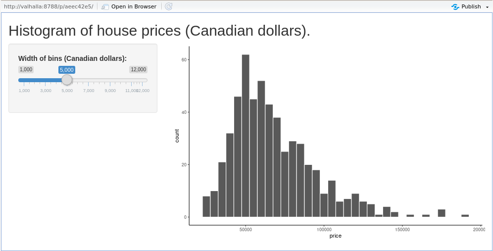
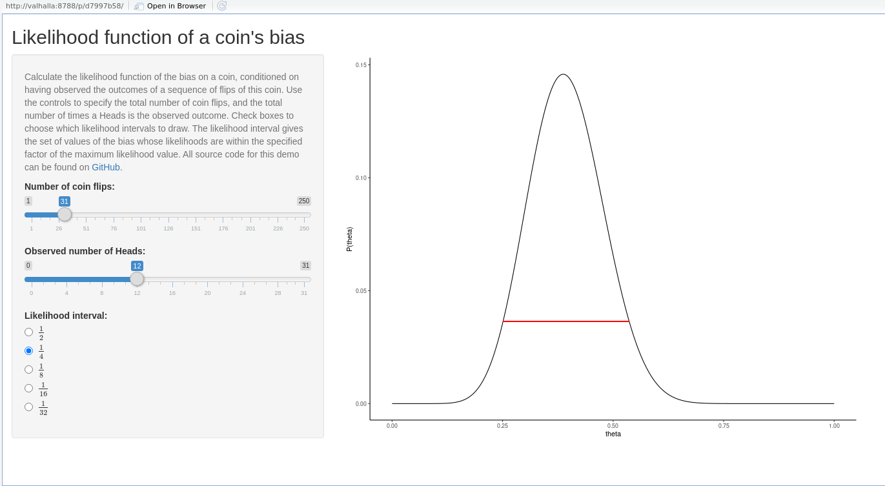
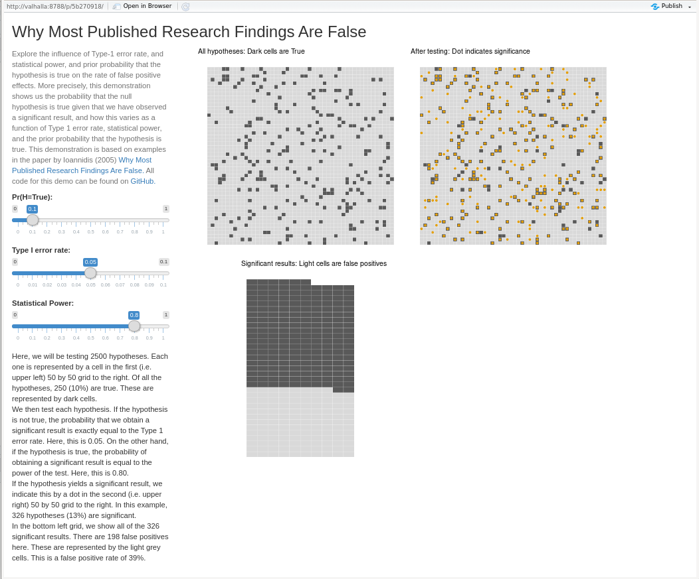
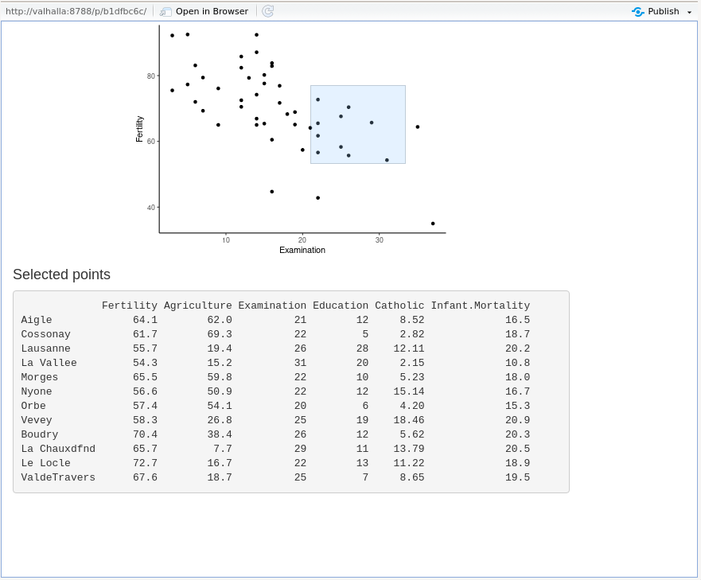
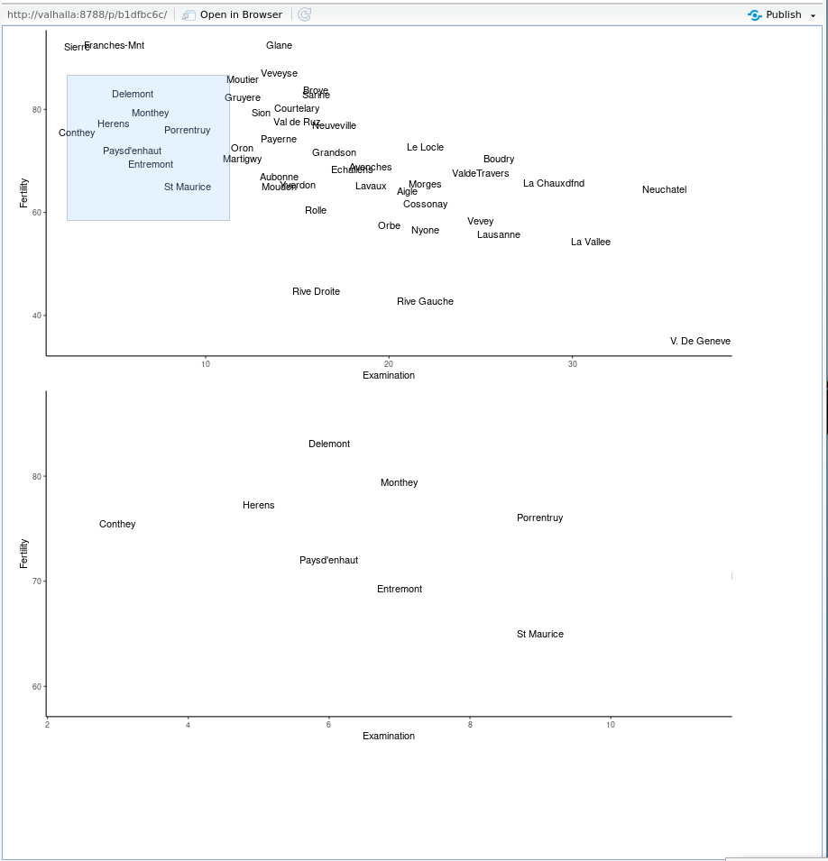
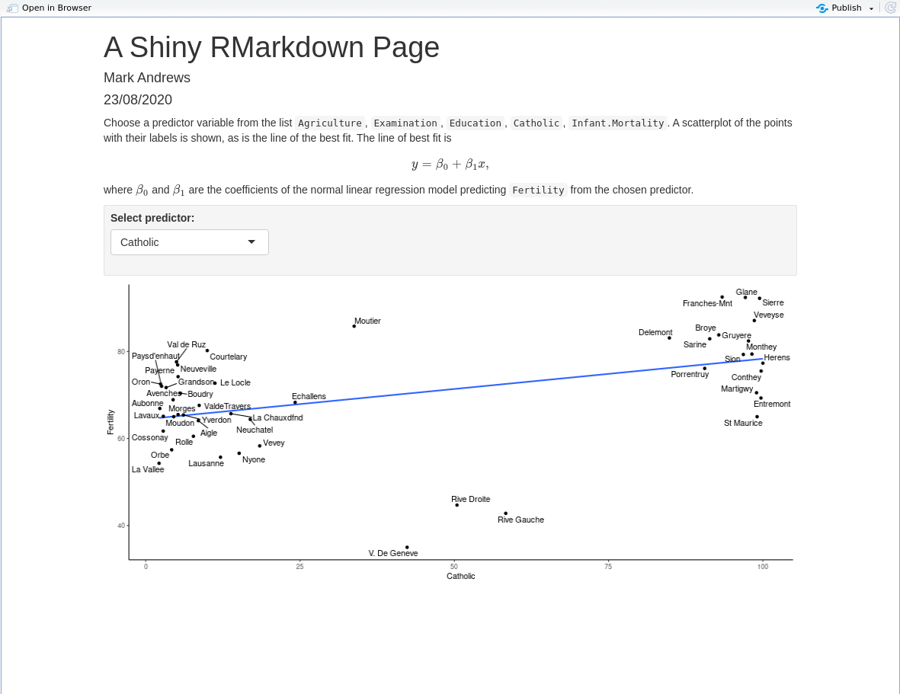
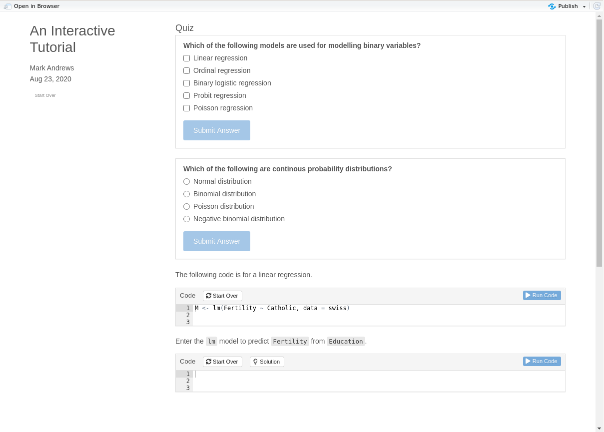

```{r, echo=F}
knitr::opts_chunk$set(warning = FALSE,
                      message = FALSE, 
                      comment='#>',
                      echo = T)
# Thanks to 
# https://github.com/ramnathv/slidify/issues/189#issuecomment-15850008
hook1 <- function(x){ gsub("```\n*```r*\n*", "", x) }
knitr::knit_hooks$set(document = hook1)
```

```{r, echo=F}
library(tidyverse)

theme_set(theme_classic())

cat_script <- function(filename, start=NA, end=NA, filename_in_comment = T, minted='stan', comment_symbol = "//", leading_trim = T){
  
  basename <- function(path){
    path %>% str_split(pattern = '/') %>% 
      extract2(1) %>% 
      tail(1)
  }
  
  lines <- readLines(filename)
  
  if (leading_trim){
    lines <- remove_leading_spaces(lines)
  }
  
  start <- ifelse(is.na(start), 1, start)
  end <- ifelse(is.na(end), length(lines), end)
  cat(sprintf("\\begin{minted}{%s}", minted), sep='\n')
  #cat(sprintf("\\begin{minted}[bgcolor=LightGray]{%s}", minted), sep='\n')
  if (filename_in_comment){
    cat(str_c(comment_symbol, ' ', basename(filename)), sep="\n")
  } 
  
  lines <- lines[start:end]
  
  if (leading_trim){
    lines <- remove_leading_spaces(lines)
  }
  
  cat(lines, sep='\n')
  cat("\\end{minted}")
}

cat_rscript <- function(filename, start=NA, end=NA, filename_in_comment = T){
  cat_script(filename = filename, start=start, end=end, filename_in_comment = filename_in_comment, minted = 'R', comment_symbol = '#')
}


```


# Introduction

Throughout this book we have performed data visualizations.
In all cases, the graphic that was produced was static: we could not interact with it directly, nor did it change or update dynamically if the data or other variables changes.
To change any graphic, we needed to modify the code or data and re-execute the code to produce a new plot.
Having gained proficiency and experience with R and `ggplot2`, modifying code and re-executing it is usually very quick and easy.
However, sometimes we want to create a graphic that others, who may have no experience or proficiency with R, can interact with and change by simply selecting options or changing parameters in a graphical interface.
Moreover, ideally we would like for this graphic and its interface to not even require the user to install R or RStudio, and for it be available instead on a webpage.
Web based graphics apps like this may often be just as valuable and useful to experienced R users who would be able to immediately use and interact the graphic without having to download data, code, or install extra R packages.

The R package *Shiny* is a powerful framework for creating interactive graphics in a web based app.
In fact, Shiny allows us to create more than just interactive graphics.
We may also use it to create dashboards, interactive tutorials, and so on.
In general, Shiny is a framework for web apps that run R --- for data analysis, statistical modelling, graphics, and so on --- on the back end. 

Shiny is a major topic.
In this chapter, we aim to provide just a brief introduction.
To learn more, the (as of August 2020) forthcoming book *Mastering Shiny* [@wickham:shiny] will be a thorough introduction (the preprint of this book is available at https://mastering-shiny.org/).
Another excellent resource for learning more about Shiny is the gallery at https://shiny.rstudio.com/gallery/, which provides both the apps themselves and the accompanying source code.

# Getting started with Shiny

RStudio makes is easy to get started with Shiny.
The necessary `shiny` R package is preinstalled, and RStudio also provides a minimal demo app, which may be studied to understand some of the core principles behind Shiny, or may then be modified to create a new app.
To use this demo, go to the *File* menu, choose *New File* and then *Shiny Web App ...*, as in Figure \ref{fig:createdemo}A.
This brings up a dialog box, as in Figure \ref{fig:createdemo}B.
There, you choose a folder to put the Shiny app, and provide a name for the app.
For the name, you can choose anything, but it is probably best to use a lowercase name with no spaces.
In Figure  \ref{fig:createdemo}B, we choose `shinydemo` inside our `Documents` folder.
You must also choose whether you want to use a single R script named `app.R` for the app, or to use two separate files named `ui.R` and `server.R`.
The single `app.R` option is the default, which we will choose.
You create the app by clicking the *Create* button.
The folder `shinydemo` is created, and inside that an R script named `app.R` is created.
The `app.R` script will then open in the RStudio file editor.
In the upper right of the tab of this file in the editor there is a button `Run App`.
Clicking this button launches a new RStudio window that runs the web app, see Figure \ref{fig:createdemo}C.
From the RStudio console, we can see that clicking this button is equivalent to running the following command.
```{r, eval=F}
shiny::runApp('Document/shinydemo')
```
As we can see, this web app is an interactive histogram where we can choose the number of bins in the histogram by using a slider.
On the bar at the top of the window, there is another button *Open in Browser*.
Clicking this will run the web app inside your default web browser.

```{r createdemo, echo=F, fig.align='center', fig.cap="A) We can create a Shiny app by selecting an option from the \\textit{File} menu. This opens a dialog box, shown in B), where we choose the name and folder for the app. The  demo app that is produced is the histogram app shown in C).", out.width='\\textwidth', fig.height = 5.0}
knitr::include_graphics('include/create_app.pdf')
```

The entirety of this demo is contained in the file `app.R` that is within the folder `Documents/shinydemo`.
This file contains only 3 statements in addition to the `library` call that loads the `shiny` package itself.
The first statement calls the function `fluidPage` and assigns the resulting object to the name `ui`.
The next defines a function that is assigned the name `server`.
The final statement calls the function `shinyApp` with input arguments `ui` and `server` as defined in the previous statements.
```{r, eval=F}
shinyApp(ui = ui, server = server)
```
As we saw above, the whole `app.R` script is then called by supplying the folder in which it exists as the first input argument (which is named `appDir`) to the `runApp` function.
Let us examine each of these parts in more detail.

## `fluidPage`

The `fluidPage` function essentially creates a webpage object.
In other words, it is an object that will determine the webpage in which the app occurs.
As the name implies, `fluidPage` creates a flexible page that will dynamically rescale in size as the webpage is resized.
It contains a set of invisible rows and columns.
As input arguments, `fluidPage` takes a number of Shiny elements.
The full `fluidApp` code in the demo `app.R` is as follows
```{r, eval=F}
ui <- fluidPage(

    # Application title
    titlePanel("Old Faithful Geyser Data"),

    # Sidebar with a slider input for number of bins 
    sidebarLayout(
        sidebarPanel(
            sliderInput("bins",
                        "Number of bins:",
                        min = 1,
                        max = 50,
                        value = 30)
        ),

        # Show a plot of the generated distribution
        mainPanel(
           plotOutput("distPlot")
        )
    )
)
```
As we can see, therefore, there are two elements as inputs to `fluidPage`: `titlePanel` and `sidebarLayout`.
The `titlePanel` simply provides the title of the web app page.
The `sidebarLayout` creates a web app page with a sidebar and a main section.
The sidebar contents are determined by the element `sidebarPanel` that is supplied as the first input to `sidebarLayout`, while the contents of the main panel are determined by the `mainPanel` element, which is the second element to `sidebarLayout`.
By default, the side and main panels occupy 1/3 and 2/3 of the width of the web app page.
This can be controlled by changing the `width` parameters in `sidebarPanel` and `mainPanel` respectively.
By default, they take the values of `4` and `8`, respectively.
Both can be changed, but the total width must be 12 or less.

As we can see, the sidebar contains a slider graphical user interface (\gui) widget, created by `sliderInput`.
\gui widgets like this play a major role in Shiny apps.
They are what allow us to dynamically and interactively supply the different parameters to the graphic object.
We will explore some others important Shiny \gui widgets below.
In `sliderInput`, there are five required input arguments: `inputID`, `label`, `min`, `max`, `value`.
The `inputID` is a name that can then be used within the code that creates the graphic.
In this example, it is `bins`.
Thus, as we will see, in the code for the histogram, we can refer to the variable `bins`, which gives us the numerical value of the slider, to determine the number of bins in the histogram.
The `label` argument to `sliderInput` is simply the the title of the slider widget.
The `min` and `max` define the starting and ending values of the slider.
Thus, in this example, the slider ranges from 1 to 50.
The `value` determines the initial position of the slider.

The `mainPanel` element of `sidebarLayout` contains `plotOutput("distPlot")`.
This is a plot output element.
As we will see, when we call `renderPlot`, it produces a plot output element that we can name.
We can then access that element by its name, which in this example is `distPlot`, by calling `plotOutput`.

## `server`

The contents of the second statement in `app.R` is as follows.
```{r, eval = F}
server <- function(input, output) {

    output$distPlot <- renderPlot({
        # generate bins based on input$bins from ui.R
        x    <- faithful[, 2]
        bins <- seq(min(x), max(x), length.out = input$bins + 1)

        # draw the histogram with the specified number of bins
        hist(x, breaks = bins, col = 'darkgray', border = 'white')
    })
}
```
As we can see, this creates a function with two input arguments, `input` and `output`, and which we name `server`.
This function is used internally by Shiny.
The `input` argument allows us to access the values returned by the \gui widgets.
For example, the value of `bins` that contains the value of the `sliderInput` is accessible by the `bins` attribute of the `input` input argument.
The `output` input argument will contain the graphics or other objects that are produced by normal R code, but which may then be accessible in, usually, the main panel of the web app page.
In this example, a base R histogram is created in the code block inside the `renderPlot` function.
This code could be run in any R script or in the console with very little modification.
Specifically, the only thing we would need to modify is `length.out = input$bins`, which obviously requires an object named `input` with an attribute named `bins`.
The value of `input$bins` will be an integer.
Replacing `input$bins` with an arbitrarily chosen integer like 20 will produce the histogram we see in Figure \ref{fig:stdhistogram}.
```{r stdhistogram, fig.cap="The static version of the histogram that is in the web app that we created.", fig.align="center", out.width="0.67\\textwidth"}
x <- faithful[, 2]
bins <- seq(min(x), max(x), length.out = 21)
hist(x, breaks = bins, col = 'darkgray', border = 'white')
```

This is an important point to emphasize.
Once you have a static graphic, produced for example by `ggplot`, this is the main code that makes up the dynamic and interactive Shiny app.
The rest of the code is ultimately producing a wrapper around this code so that it appears in the web app page, and also creating widgets that all you to control parameters and other properties of the graphic.

## `shinyApp`

The final statement in our `app.R` is a simple function call to `shinyApp`.
We supply two arguments named `ui` and `server`.
In this example, their values are also `ui` and `server`, respectively, but this is not necessary.
This function call is then used internally by the Shiny server.

## `runApp`

The Shiny server that runs our app is run by `runApp` where we supply the directory that contains `app.R`.
In general, this directory usually contains either a file named `app.R` that ends with an expression returning a Shiny app object, i.e. by a call to `shinyApp`, or else two separate files named `ui.R` and `server.R`.

The app that is run will contain, as shown in Figure \ref{fig:createdemo}C, a side panel with a \gui slider and a main panel with a histogram.
This app is *reactive*: whenever we move the slider, the histogram is redrawn using the new value of the slider, which is available to it through `input$bins`, as we've just seen.

## Modifying the demo app

Let us now modify the demo in a few simple ways.
We will make the histogram using `ggplot`, rather than base R.
We will also use another data set, which we will read in using `read_csv`, and we will use a slider to modify the `binwidth` of the histogram, rather than the number of bins.

As a first step, we will make the static version of the plot.
```{r, fig.cap="A static version of the graphic we will put in a Shiny app.", fig.align="center", out.width="0.67\\textwidth"}
library(tidyverse)

housing_df <- read_csv('data/housing.csv')

ggplot(housing_df, aes(x = price)) +
  geom_histogram(binwidth = 10000, colour = 'white') +
  theme_classic()
```
This code, mostly as is, will go inside the new `app.R` that we create.
All that we will change is that instead of `binwidth = 10000`, we will put `binwidth = input$binwidth`, where `binwidth` is the value returned by our slider.

At the start of the app, we load the necessary packages and the data.
```{r, eval=F}
library(shiny)
library(tidyverse)

houseprices_df <- read_csv("housing.csv")
```
Next, we modify the `fluidPage` as follows.
```{r, eval=F}
ui <- fluidPage(
    titlePanel("Histogram of house prices (Canadian dollars)."),
    
    sidebarLayout(
        sidebarPanel(
            sliderInput("binwidth",
                        "Width of bins (Canadian dollars):",
                        min = 1000,
                        max = 12000,
                        step = 1000,
                        value = 5000)
        ),
        mainPanel(
           plotOutput("houseprices_hist")
        )
    )
)
```
This is very similar to the original.
The main difference is that the `inputId` of `sliderInput` is now `binwidth` and the slider takes values from 1000 to 12000 is steps of 1000, with its initial position being 5000.

The `server` is as follows.
```{r}
server <- function(input, output) {

    output$houseprices_hist <- renderPlot({

      ggplot(houseprices_df, aes(x = price)) +
        geom_histogram(binwidth = input$binwidth, colour = 'white') +
        theme_classic() 
      
    })
}
```
Note that the rendered plot object is stored as `output$houseprices_hist`, which is then accessible in the main panel of the `ui` via the `plotOutput` function call.
The resulting web app is shown in Figure \ref{fig:gghist}.
```{r gghist, echo=F, out.width='0.67\\textwidth', fig.cap="Screenshot of a Shiny web page with a \\texttt{ggplot} histogram.", fig.align="center"}

```

# Extending the demo app

RStudio's demo app with a side panel and main panel is a prototypical, albeit minimal, Shiny web app.
Here, we will consider a few different ways in which it can be easily extended to create new apps.

## Using multiple widgets

In the demo app, there was one widget and one graphic.
We may have multiple widgets each controlling parameters of one or more plots.
To see examples of these, let us first consider a variant of the Shiny app available at [https://lawsofthought.shinyapps.io/binomial_likelihood](https://lawsofthought.shinyapps.io/binomial_likelihood), and whose source code is available at [https://github.com/lawsofthought/psypag-kent-2017](https://github.com/lawsofthought/psypag-kent-2017).
A screenshot of this app is shown in Figure \ref{fig:likelihoodapp}.
This app has three widgets --- two sliders and one set of radio buttons --- that control the one graphic.
Interestingly, the two sliders are not independent.
As the first changes, the range of values of the second changes too.
In addition to these widgets, there is a block of explanatory text.

```{r likelihoodapp, echo = F, fig.cap ="A web app with multiple widgets in the left slide panel.", fig.align="center", out.width="0.75\\textwidth"}

```

Using multiple widgets and text blocks is very straightforward.
For example, in the `sidebarPanel`, we may include as many \gui widgets as needed, as in the following partial code (ellipsis indicate removed code).
```{r, eval = F}
ui <- fluidPage(
  ...
  
  sidebarLayout(
    
    sidebarPanel(
      helpText(...),
      sliderInput(...),
      sliderInput(...),
      radioButtons(...)
    ),

    mainPanel(...)
  )
)
```

Note that the `helpText` widget creates the explanatory text box.
This may include multiple text strings and also html elements.
For example, for the app linked above, the contents of `helpText` is partially as follows (the ellipses indicate removed text).
```{r, eval = F}
helpText("Calculate the likelihood function of the bias on a coin, 
          conditioned on having observed the outcomes of a sequence of flips of this coin. 
          ...
         of the maximum likelihood value.",
         "All source code for this demo can be found on",
         a("GitHub.", href="https://github.com/lawsofthought/psypag-kent-2017", target='_blank'))
```
Here, the `a` function is from `htmltools` and allows us to make URL hyperlinks.

The `radioButtons` widget is a commonly used \gui widget.
It allows us to select exactly one of multiple different options.
For example, to provide radio buttons for choosing one of five colours from a list, we may use the following.
```{r, eval=F}
radioButtons("colour_pick", 
             label="Pick a colour:",
             choices=c("red", "green", "blue", "white", "yellow")
)
```
We could also use a variant like the following.
```{r, eval=F}
radioButtons("colour_pick", 
             label="Pick a colour:",
             choices=c("red" = 1, "green" = 2, "blue" = 3, "white" = 4, "yellow" = 5)
)
```
In this case, the colour names are shown as the radio button options but the value associated with the `colour_pick` variable is the value associated with the name is in the named vector `choices`.
In other words, the user will be presented the names *red*, *green*, *blue*, *white*, *yellow* in the radio buttons \gui widget.
Their choice will be stored as the value of `colour_pick`, which will be either 1, 2, 3, 4, or 5.
This use of a named vector for the `choice` argument allows us to use \LaTeX\ code like $\tfrac{1}{2}$ etc as the labels of the radio buttons, as in the app linked above.

We may also have widgets that themselves are modified by other widgets.
In the app linked above, the `sidebarPanel` contains the element `uiOutput("n.obs.slider")`.
This is an element that is available as an element of the `output` argument of the `server` function.
Inside that function, the relevant code is as follows.
```{r, eval=F}
output$n.obs.slider <- renderUI({
  sliderInput("n.obs", 
              "Observed number of Heads: ", 
              min=0, 
              max=input$N, 
              step=1,
              value=max(1, 0.4*input$N))
})
```
This `renderUI` function acts like a `renderPlot` function in that takes values specified in the `input` argument and it returns an object that will be displayed on the web app page.
In this case, that object is a `sliderInput`.
As we can see from the code above, this object uses the value of `input$N`, which is from another slider, whose code within `sidebarPanel` is as follows.
```{r, eval = F}
sliderInput("N",
            "Number of coin flips:",
            min = 1,
            max = 250,
            value = 130, 
            step = 1)
```
Thus, this slider ranges from 1 to 250, and the value it selects is recorded as `N`, which is available in the `server` function as `input$N`.
In the dynamically rendered slider, this value is used to set the `max` and initial values of the slider.
Examples of the dynamic interaction of widgets are shown in Figure \ref{fig:interactingwidgets}.

```{r interactingwidgets, fig.cap="Examples of interacting widgets. When the upper widget changes, it changes the end point and intitial condition of the middle widget.", fig.align='center', echo=F}
knitr::include_graphics('include/interacting_widgets.pdf')
```

## Dynamic text

Consider the app available at [https://lawsofthought.shinyapps.io/false_discovery/](https://lawsofthought.shinyapps.io/false_discovery/), and whose source code is at [https://github.com/lawsofthought/replication-crisis-demos](https://github.com/lawsofthought/replication-crisis-demos).
A screenshot of this app is provided in Figure \ref{fig:falsediscoveryapp}.
```{r falsediscoveryapp, echo=F, fig.cap="A web app with multiple graphics being controlled by multiple widgets.", out.width='\\textwidth'}

```

In this app, there are three sliders that control three graphics.
In addition, these sliders control the text shown in the bottom text block in the left side panel.
The code to accomplish this is partially as follows (ellipsis indicate omitted text or code).
```{r, eval=F}
output$text <- renderUI({

  stmt.1 <- sprintf(...)
  
  stmt.2 <- sprintf(...)
  
  stmt.3 <- sprintf(...)
  
  stmt.4 <- sprintf(...)
  
  HTML(paste(stmt.1, stmt.2, stmt.3, stmt.4, sep = '<br/>'))
})
```
From this, we see that `renderUI` returns a `HTML` object whose input is text generated by multiple `sprintf` statements.
This object is saved as the `text` attribute of the `output` object.
It is then accessible inside the `ui` object using `htmlOutput("text")`, which is an element in the side panel.
Examples of the `sprintf` statements are as follows.
```{r, eval=F}
stmt.1 <- sprintf("Here, we will be testing %d hypotheses.
                  Each one is represented by a cell in the first 
                  (i.e. upper left) %d by %d grid to the right.
                  Of all the hypotheses, %d (%d%%) are true.
                  These are represented by dark cells.",
                  N*M,
                  N,
                  M,
                  as.integer(input$prior*N*M),
                  as.integer(100*input$prior))

stmt.2 <- sprintf("We then test each hypothesis. If the hypothesis is not true, 
                  the probability that we obtain a
                  significant result is exactly equal to the Type 1 error rate. 
                  Here, this is %2.2f.
                  On the other hand, if the hypothesis is true, 
                  the probability of obtaining a significant
                  result is equal to the power of the test. 
                  Here, this is %2.2f.",
                  input$alpha,
                  input$power)
```
The first argument to the `sprintf` statements is a text block with placeholders like `%d` (for integers) and `%2.2f` (for floats).
The values of these are taken from variable in the code, such as `N` or `M`, and also from the values of the sliders, e.g. `input$prior`, `input$alpha`, `input$power`.

## Multiple graphics

In the app shown in Figure \ref{fig:falsediscoveryapp}, there are three graphics.
There are different ways to present multiple graphics, but perhaps the easiest is to use a plot grid as we would in a figure panel in an article.
In the code used to produce the app shown in Figure \ref{fig:falsediscoveryapp}, three `ggplot` graphics were produced.
These were given names and then `gridExtra::grid.arrange()` is used to put them in a grid.
The relevant code is partially as follows (ellipsis indicate removed code).
```{r, eval=F}
p0 <- ggplot(z, ...) + ... + ggtitle('All hypotheses: Dark cells are True')

p1 <- p0 + ... + ggtitle('After testing: Dot indicates significance')

p2 <- ggplot(...) + ggtitle("Significant results: Light cells are false positives")

grid.arrange(p0, p1, p2, nrow=2, ncol=2)
```

# Interactive graphics

Thus far, the plots all dynamically update in reaction to a change in the widgets.
After each update, we nonetheless have a static graphic as we would had we produced the `ggplot` in RStudio directly.
It is possible, however, to directly interact with Shiny graphics in ways not possible with normal plots in R.

## Selecting points

The `nearPoints` and `brushedPoints` allow us to select points on a plot and show the corresponding rows in a data frame.
Consider the scatterplot shown in Figure \ref{fig:swissplot} that is produced by the following code.
```{r swissplot, fig.cap = "A scatterplot of a measure of fertility rates in Swiss regions in the 1880s plotted against the percentage of army draftees receiving highest scores on an entrance exam.", fig.align="center", out.width="0.67\\textwidth"}
ggplot(swiss,
       mapping = aes(x = Examination, y = Fertility)
) + geom_point()
```
```{r, echo=F}
original_width <- getOption('width')
options(width = 300)
```

Each point represents two of the variables --- `Fertility` and `Examination` --- in the R built-in `swiss` data set.
```{r}
head(swiss)
```
Using `brushedPoints`, we can select a region of the scatterplot and and the corresponding rows in the `swiss` data frame are shown.
An example of an app that does this is shown in Figure \ref{fig:brush_select}.
```{r brush_select, fig.cap="The \\texttt{brushedPoints} function allows us to select regions of a, for example, scatterplot and the corresponding rows of the data frame used by the plot are then shown in a table.", out.width="\\textwidth", echo=F}

options(width = original_width)
```

The `app.R` code that produces the app shown in Figure \ref{fig:brush_select} has `ui` and `server` statements as before.
The `ui` statement is as follows.
```{r, eval=F}
ui <- fluidPage(
  fluidRow(
    column(width = 10, 
           align="center",
           plotOutput("scatterplot", 
                      height = 300, 
                      width = 400,
                      brush = brushOpts(id = "selected_region")))
  ),
  fluidRow(
    column(width = 10,
           h4("Selected points"),
           verbatimTextOutput("selected_region_info")
    )
  )
)
```
Here, we see two `fluidRow` elements in `fluidPage`.
As is obvious, a `fluidRow` is a row of a `fluidPage`, and each `fluidRow` is divided into columns using the `column` element.
In this case, the first row has one column of width 10, and this has a `plotOutput` element in it, which will show a plot named `scatterplot` that is rendered by the server function.
This `plotOutput` element has `brush = brushOpts(id = "selected_region")` as an input argument.
This allows the user to *brush* or select a rectangular region of the graphic.
The properties of this rectangular region are then saved using the id `selected_region`.
The second row of the page has a `verbatimTextOutput` element, which is a fixed width text region.

The `server` code is as follows.
```{r, eval=F}
server <- function(input, output){
  
  output$scatterplot <- renderPlot({
    ggplot(swiss, aes(x = Examination, y = Fertility)) +
      geom_point() +
      theme_classic()
  })

  output$selected_region_info <- renderPrint({
    brushedPoints(swiss, input$selected_region)
  })
}
```
The first output element is the `ggplot` produced by `renderPlot`, just like we've seen before.
The second output element is produced by `renderPrint` and uses the `brushPoints` function, which uses `input$select_region`, defined in the `ui`, and selects the rows in `swiss` that are selected in the brushed region.
The object returned by `renderPrint` is saved as `selected_region_info` to the `output` object.
This is then accessible in `ui` using the function `verbatimTextOutput`.

## Zooming

Using, for example, `brush = brushOpts` inside a `plotOutput` element in `ui`, we can select a region and then zoom into it.
We could, for example, zoom into that region in the same graphic, or alternatively, zoom into that region in a second accompanying graphic.
We will consider the second version here.
For this, the graphic that we will zoom into regions of is the `swiss` scatterplot above but with labels on the points.
For this, we will use the default `ggplot` labelling method of `geom_text`, which we already saw in Chapter 4.
```{r, fig.cap = "A labelled scatterplot using the \\texttt{swiss} data set. Zooming into this plot allows us to see the otherwise cluttered points.", echo = T, out.width="0.67\\textwidth", fig.align="center"}
swiss %>% 
  as_tibble(rownames = 'region') %>% 
  ggplot(aes(x = Examination, y = Fertility, label = region)) +
  geom_point() +
  geom_text()
```
Using the default sizes for points, labels, and segments, the resulting labeled scatterplot is a bit cluttered.
Zooming into regions is therefore a useful option in this case.
A screenshot of the app that accomplishes this is shown in Figure 
```{r, fig.cap="Using  \\texttt{brushedPoints}to select a region in the upper graphic that is zoomed into in the lower graphic", fig.align='center', echo=F, out.width="0.7\\textwidth"}

```

As before, this `app.R` primarily consists of the `ui` and the `server`.
The `ui` is as follows.
```{r, eval=F}
ui <- fluidPage(
  fluidRow(
    column(width = 8,
           plotOutput("scatterplot", height = 400, width = 800,
                      brush = brushOpts(
                        id = "selected_region"
                      )
           )
    ),
    column(width = 8,
           plotOutput("scattersubplot", height = 400, width = 800)
    )
  )
)
```
Here, we have two `plotOutput` elements, the first of which has a `brush = brushOpts(...)` argument, which allows regions to be selected in it.
The corresponding `server` code is as follows.
```{r}
server <- function(input, output) {
  
  xyrange <- reactiveValues(x = NULL, y = NULL)
  
  output$scatterplot <- renderPlot({
    ggplot(swiss_df,
           aes(x = Examination, y = Fertility, label = region)) +
      geom_text()
  })
  
  output$scattersubplot <- renderPlot({
    ggplot(swiss_df,
           aes(x = Examination, y = Fertility, label = region)) +
      geom_text() +
      coord_cartesian(xlim = xyrange$x, ylim = xyrange$y)
  })
  
  observe({
    sel_reg <- input$selected_region
    xyrange$x <- c(sel_reg$xmin, sel_reg$xmax)
    xyrange$y <- c(sel_reg$ymin, sel_reg$ymax)
  })
  
}
```
The principal new statement here is the `observe` function call.
This is coupled to the `reactiveValues` statement that defines a dynamically updated object.
In this case, this is named `xyrange`, which has attributes `x` and `y`.
The `observe` function listens for changes in the brushed region, which is `input$selected_region`.
When changes occur, `xyrange` updates its `x` and `y` values.
The second plot, named `scattersubplot`, uses `xyrange$x` and `xyrange$y` as the limits of its axes, specified using `coord_cartesian`.


# RMarkdown based Shiny apps

In Chapter 7, we introduced RMarkdown.
There, we primarily considered how RMarkdown can be used to create reproducible articles for publication and other communication purposes.
RMarkdown is also widely used for creating webpages via the `html_document` output format.
Normally, the resulting html documents are static documents.
However, we may create dynamic webpages using `html_document` and Shiny.
To host these webpages on the web, the web server must run the Shiny server.
However, we may easily send this document to other RStudio users who may then use it immediately within RStudio itself.

```{r rmarkdownshiny, fig.cap = "A html page made with RMarkdown that contains a Shiny app.", fig.align="center", out.width="\\textwidth", echo=F}

```

An example of a Shiny based RMarkdown webpage is shown in Figure \ref{fig:rmarkdownshiny}.
This contains some explanatory text, and then an app that shows a labelled scatterplot using one of five different predictor variables.
The RMarkdown document that created this page has the following in its YAML header.
```
---
title: "A Shiny RMarkdown Page"
author: "Mark Andrews"
date: "23/08/2020"
output: html_document
runtime: shiny
---
```
Much of this information is standard.
For example, we supply a `title`, `author`, `date` as usual, and we set the `output` to be `html_document`.
The only new field is `runtime`, which takes the value of `shiny`.

The text in the document is typical of a Rmarkdown document, including some \LaTeX\ maths, which is delimited by `$$`.
The Shiny app is all contained in the following R chunk in the document.
```{r, eval = F}
library(tidyverse)
library(ggrepel)

inputPanel(
  selectInput("predictor", 
              label = "Select predictor:",
              choices = c("Agriculture",
                          "Examination",
                          "Education",
                          "Catholic",
                          "Infant.Mortality")
  )
)

renderPlot({
  swiss %>% 
  as_tibble(rownames = 'region') %>% 
  ggplot(aes_string(x = input$predictor, y = "Fertility", label = "region")) +
  stat_smooth(method = 'lm', se = F) +
  geom_point() +
  geom_text_repel() +
  theme_classic()
})
```
Here, we have two Shiny statements: `inputPanel` and `renderPlot`.
Note that these are not separated into `ui` and `server` objects like in the previous examples.
Nor do we have to call `shinyApp`.
The `renderPlot` function is just like in the examples we have seen earlier.
In the `inputPanel`, we create a dropdown selector widget that allows us to choose the value the variable `predictor`.
This is then accessed as `input$predictor` within the `renderPlot`.


## Making `learnr` tutorials

A variant of the Shiny based RMarkdown html document can be used to create interactive tutorials.
This uses the `learnr` package.
An example of a tutorial, albeit with no text, but with a quiz, and code execution widgets is shown in Figure \ref{fig:learnr}.
```{r learnr, fig.cap="An example of a \\texttt{learnr} tutorial.", out.width="\\textwidth", echo=F}

```

The YAML header for this example tutorial is as follows.
```
---
title: "An Interactive Tutorial"
author: "Mark Andrews"
date: "Aug 23, 2020"
output: learnr::tutorial
runtime: shiny_prerendered
---
```
Note that the output is `learnr::tutorial` and the `runtime` is `shiny_prerendered`.
Pre-rendered Shiny documents are rendered once prior to their deployment, rather than for each browser session.

To create the quiz items, we include the following code in normal R chunk.
```{r, eval=F}
quiz(
  question("Which of the following models are used for modelling binary variables?",
    answer("Linear regression"),
    answer("Ordinal regression"),
    answer("Binary logistic regression", correct = TRUE),
    answer("Probit regression", correct = TRUE),
    answer("Poisson regression")
  ),
  question("Which of the following are continous probability distributions?",
    answer("Normal distribution", correct = TRUE),
    answer("Binomial distribution"),
    answer("Poisson distribution"),
    answer("Negative binomial distribution")
  )
)
```

The first code execution widget contains the following code in a chunk with the options `exercise = TRUE`.
```{r, eval=F}
M <- lm(Fertility ~ Catholic, data = swiss)
```
The inclusion of `exercise = TRUE` as a chunk option will allow this code, or any modification of it, to be executed in the webpage.
Any output from this executed code will also be shown in the page.

The second code execution widget contains a *blank* R chunk with `exercise = TRUE` as an option.
The label for this R chunk is `swiss_lm_2`, and another R chunk labelled `swiss_lm_2-solution` contains the R code that is the solution to the exercise, and available via the *Solution* button.

# Deploying Shiny apps

Shiny apps and webpages, like those created by RMarkdown, that contain Shiny apps must be hosted by a Shiny server.
There are two main options for doing this.
The first is to use RStudio's Shiny server, which is available https://www.shinyapps.io/.
This is paid-for service.
However, there is a free tier that allows users to have 5 separate app projects, and 25 user hours per month.
The other options include up to 10000 user hours per month and unlimited projects.

Alternatively, we may install the Shiny server, which is open source software, on our own server.
The source code and precompilied binaries for major Linux distributions are available at https://rstudio.com/products/shiny/download-server/.
This option, of course, requires that we have a server, such as a virtual private server, available to us.
However, these may be rented from many providers for prices starting at around $10 per month.
In addition, to install and configure the Shiny server, some (usually Linux) server admin knowledge and experience is required.
See, for example, https://www.digitalocean.com/community/tutorials/how-to-set-up-shiny-server-on-ubuntu-16-04 for a guide on how to set up a Shiny server on a Linux virtual private server. 

# References


