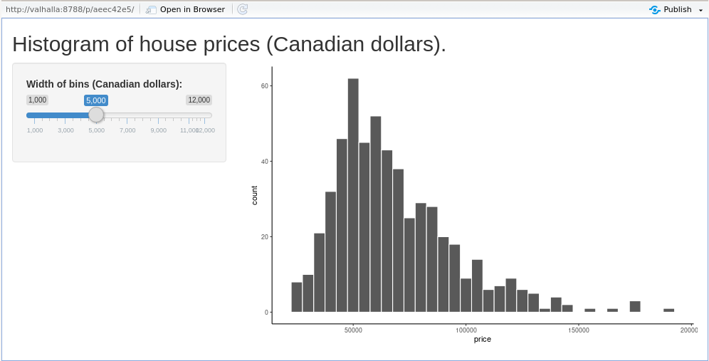

```{r, echo=F}
knitr::opts_chunk$set(warning = FALSE,
                      message = FALSE, 
                      comment='#>',
                      echo = T)
# Thanks to 
# https://github.com/ramnathv/slidify/issues/189#issuecomment-15850008
hook1 <- function(x){ gsub("```\n*```r*\n*", "", x) }
knitr::knit_hooks$set(document = hook1)
```

```{r, echo=F}
library(tidyverse)

theme_set(theme_classic())

cat_script <- function(filename, start=NA, end=NA, filename_in_comment = T, minted='stan', comment_symbol = "//", leading_trim = T){
  
  basename <- function(path){
    path %>% str_split(pattern = '/') %>% 
      extract2(1) %>% 
      tail(1)
  }
  
  lines <- readLines(filename)
  
  if (leading_trim){
    lines <- remove_leading_spaces(lines)
  }
  
  start <- ifelse(is.na(start), 1, start)
  end <- ifelse(is.na(end), length(lines), end)
  cat(sprintf("\\begin{minted}{%s}", minted), sep='\n')
  #cat(sprintf("\\begin{minted}[bgcolor=LightGray]{%s}", minted), sep='\n')
  if (filename_in_comment){
    cat(str_c(comment_symbol, ' ', basename(filename)), sep="\n")
  } 
  
  lines <- lines[start:end]
  
  if (leading_trim){
    lines <- remove_leading_spaces(lines)
  }
  
  cat(lines, sep='\n')
  cat("\\end{minted}")
}

cat_rscript <- function(filename, start=NA, end=NA, filename_in_comment = T){
  cat_script(filename = filename, start=start, end=end, filename_in_comment = filename_in_comment, minted = 'R', comment_symbol = '#')
}


```


# Introduction

* The R package *Shiny* is a powerful framework for creating interactive graphics in a web based app.
* We may also use it to create dashboards, interactive tutorials, and so on.
* Shiny is a major topic.
* In this chapter, we aim to provide just a brief introduction.

# Getting started with Shiny

```{r createdemo, echo=F, fig.align='center', fig.cap="A) We can create a Shiny app by selecting an option from the \\textit{File} menu. This opens a dialog box, shown in B), where we choose the name and folder for the app. The  demo app that is produced is the histogram app shown in C).", out.width='0.6\\textwidth', fig.height = 5.0}
knitr::include_graphics('include/create_app.pdf')
```

# 

* The entirety of this demo is contained in the file `app.R` that is within the folder `Documents/shinydemo`.
* The first statement calls the function `fluidPage` and assigns the resulting object to the name `ui`.
* The next defines a function that is assigned the name `server`.
* The final statement calls the function `shinyApp` with input arguments `ui` and `server` as defined in the previous statements.


# `fluidPage`

The `fluidPage` function essentially creates a webpage object.
\footnotesize
```{r, eval=F}
ui <- fluidPage(

    # Application title
    titlePanel("Old Faithful Geyser Data"),

    # Sidebar with a slider input for number of bins 
    sidebarLayout(
        sidebarPanel(
            sliderInput("bins",
                        "Number of bins:",
                        min = 1,
                        max = 50,
                        value = 30)
        ),

        # Show a plot of the generated distribution
        mainPanel(
           plotOutput("distPlot")
        )
    )
)
```
\normalsize
As we can see, therefore, there are two elements as inputs to `fluidPage`: `titlePanel` and `sidebarLayout`.

# `server`

The contents of the second statement in `app.R` is as follows.
\footnotesize
```{r, eval = F}
server <- function(input, output) {

    output$distPlot <- renderPlot({
        # generate bins based on input$bins from ui.R
        x    <- faithful[, 2]
        bins <- seq(min(x), max(x), length.out = input$bins + 1)

        # draw the histogram with the specified number of bins
        hist(x, breaks = bins, col = 'darkgray', border = 'white')
    })
}
```
\normalsize

As we can see, this creates a function with two input arguments, `input` and `output`, and which we name `server`.
This function is used internally by Shiny.

# `shinyApp`

* The final statement in our `app.R` is a simple function call to `shinyApp`.
* We supply two arguments named `ui` and `server`.
```{r, eval=F}
shinyApp(ui = ui, server = server)
```

# Modifying the demo app

* Let us now modify the demo in a few simple ways.
* We will make the histogram using `ggplot`, rather than base R.
* As a first step, we will make the static version of the plot.
```{r, fig.cap="A static version of the graphic we will put in a Shiny app.", fig.align="center", out.width="0.37\\textwidth"}
library(tidyverse)

housing_df <- read_csv('data/housing.csv')

ggplot(housing_df, aes(x = price)) +
  geom_histogram(binwidth = 10000, colour = 'white') +
  theme_classic()
```

# 

At the start of the app, we load the necessary packages and the data.
```{r, eval=F}
library(shiny)
library(tidyverse)

houseprices_df <- read_csv("housing.csv")
```
Next, we modify the `fluidPage` as follows.
\footnotesize
```{r, eval=F}
ui <- fluidPage(
    titlePanel("Histogram of house prices (Canadian dollars)."),
    
    sidebarLayout(
        sidebarPanel(
            sliderInput("binwidth",
                        "Width of bins (Canadian dollars):",
                        min = 1000,
                        max = 12000,
                        step = 1000,
                        value = 5000)
        ),
        mainPanel(
           plotOutput("houseprices_hist")
        )
    )
)
```
\normalsize

# 

The `server` is as follows.
```{r}
server <- function(input, output) {

    output$houseprices_hist <- renderPlot({

      ggplot(houseprices_df, aes(x = price)) +
        geom_histogram(binwidth = input$binwidth, colour = 'white') +
        theme_classic() 
      
    })
}
```

# 

The resulting web app is shown in Figure \ref{fig:gghist}.
```{r gghist, echo=F, out.width='0.67\\textwidth', fig.cap="Screenshot of a Shiny web page with a \\texttt{ggplot} histogram.", fig.align="center"}

```

# RMarkdown based Shiny apps

* In Chapter 7, we introduced RMarkdown.
* RMarkdown is also widely used for creating webpages via the `html_document` output format.
* We may create dynamic webpages using `html_document` and Shiny.

```{r rmarkdownshiny, fig.cap = "A html page made with RMarkdown that contains a Shiny app.", fig.align="center", out.width="0.6\\textwidth", echo=F}
knitr::include_graphics('include/rmarkdownshiny.png')
```

# 

The RMarkdown document that created this page has the following in its YAML header.
```
---
title: "A Shiny RMarkdown Page"
author: "Mark Andrews"
date: "23/08/2020"
output: html_document
runtime: shiny
---
```
Much of this information is standard.
The only new field is `runtime`, which takes the value of `shiny`.

# 

The text in the document is typical of a Rmarkdown document, including some \LaTeX\ maths, which is delimited by `$$`.
The Shiny app is all contained in the following R chunk in the document.
\footnotesize
```{r, eval = F}
library(tidyverse)
library(ggrepel)

inputPanel(
  selectInput("predictor", 
              label = "Select predictor:",
              choices = c("Agriculture",
                          "Examination",
                          "Education",
                          "Catholic",
                          "Infant.Mortality")
  )
)

renderPlot({
  swiss %>% 
  as_tibble(rownames = 'region') %>% 
  ggplot(aes_string(x = input$predictor, y = "Fertility", label = "region")) +
  stat_smooth(method = 'lm', se = F) +
  geom_point() +
  geom_text_repel() +
  theme_classic()
})
```
\normalsize


# Deploying Shiny apps

* Shiny apps and webpages, like those created by RMarkdown, that contain Shiny apps must be hosted by a Shiny server.
* There are two main options for doing this.
* The first is to use RStudio's Shiny server, which is available https://www.shinyapps.io/.
* This is paid-for service.
* However, there is a free tier that allows users to have 5 separate app projects, and 25 user hours per month.
* The other options include up to 10000 user hours per month and unlimited projects.
* Alternatively, we may install the Shiny server, which is open source software, on our own server.
* The source code and precompilied binaries for major Linux distributions are available at https://rstudio.com/products/shiny/download-server/.


